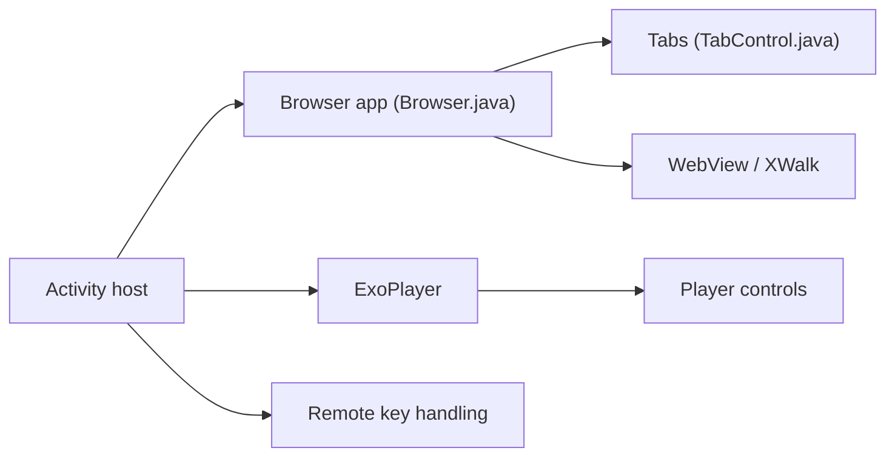

# yuliskov/SmartTubeLegacy

> Ancien client YouTube pour Android TV et boîtiers FireTV, sans dépendance aux services Google.

## Le problème
Les téléviseurs Android et boîtiers sans services Google n'ont pas de client YouTube adapté à la télécommande et à la 4K.

## Ce que ça fait vraiment
Application Android TV avec connexion, recherche multilingue, 4K et mise à jour automatique. Au lancement, l'écran de démarrage choisit le mode de lecture : WebView ou XWalk en 1080p, ou ExoPlayer combiné à l'un des deux pour la 4K ; résolution et codec maximums sont réglables. Le code est un navigateur Android adapté (onglets, contrôleur, moteurs de recherche) plus un lecteur ExoPlayer.

## Comment c'est branché


## Essayer
```bash
adb install -r SmartYouTubeTV_Orig.apk
```

## Coût et pièges
Gratuit, mais le dépôt est archivé (dernier push octobre 2023) avec 447 issues ouvertes ; l'installation passe par ADB ou FireTV.

## Ce que ce n'est pas
Pas la version maintenue : le nom « Legacy » indique un ancien projet. Il n'est pas officiel et dépend de YouTube, dont le fonctionnement peut le casser.

## Alternatives
Aucune alternative nommée dans le README.

## Pour toi
À ignorer : archivé et hors sujet pour un profil data/IA.

