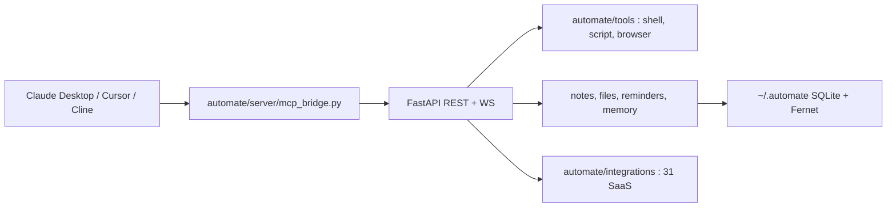

# yuruotong1/autoMate

> Serveur local qui donne notes, fichiers, mémoire et quarante outils à n'importe quel client IA.

## Le problème
Aucun client IA ne se souvient de quoi que ce soit d'un fournisseur à l'autre.
Notes, fichiers et rappels restent enfermés dans l'outil du jour.

## Ce que ça fait vraiment
Une couche derrière le chat, exposée en MCP-over-HTTP, que Claude Desktop, Cursor ou Cline consomment comme outils.
Données personnelles : `notes.*`, `files.*` (coffre adressé par contenu), `reminders.*`, `memory.*`,
et `search.find` en récupération hybride BM25 (SQLite FTS5) sur notes et fichiers en un appel.
Exécuteurs locaux (`shell.*`, `script.*`, `browser.*`, `desktop.*`), 31 connecteurs SaaS, 25 fournisseurs de LLM.

## Comment c'est branché


## Essayer
```bash
pip install automate-hub
automate
```

## Coût et pièges
Le socle est gratuit mais la transcription audio et autoMate Cloud sont un palier Pro payant.
Le jeton du point `/mcp/` vaut mot de passe : qui l'a peut appeler `shell.exec` sur ta machine.

## Ce que ce n'est pas
Pas un agent autonome : le cerveau reste ton client, sauf en mode web local.
Pas un service géré — le serveur tourne chez toi, avec tes clés.
Pas prêt pour l'exposition réseau : il écoute sur `127.0.0.1` par défaut, et c'est voulu.

## Alternatives
OpenClaw, présenté comme la brique complémentaire pour les canaux de messagerie.

## Pour toi
Idée intéressante d'un entrepôt de données personnel partagé entre agents ; le jeton `shell.exec` impose la prudence.
