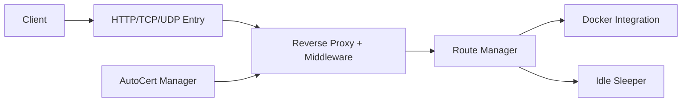

# yusing/go-proxy

> Reverse proxy léger (GoDoxy) avec WebUI, qui découvre les conteneurs Docker et gère les certificats.

## Le problème
Exposer plusieurs services auto-hébergés derrière des sous-domaines sans écrire les routes à la main.

## Ce que ça fait vraiment
Lit les conteneurs Docker ou Podman, crée les routes depuis les labels (`proxy.aliases`), recharge à chaud, gère Let's Encrypt en DNS-01, proxy TCP/UDP, SSO OpenID Connect, règles IP, mise en veille de conteneurs et de LXC Proxmox selon le trafic.

## Comment c'est branché


## Essayer
```bash
/bin/sh -c "$(curl -fsSL https://raw.githubusercontent.com/yusing/godoxy/main/scripts/setup.sh)"
docker compose up -d
```

## Coût et pièges
DNS joker à configurer ; mode réseau host obligatoire. Le script d'installation est exécuté directement depuis le web. Linux amd64 et arm64 seulement.

## Ce que ce n'est pas
Pas un outil ML ; le README précise que le dépôt est celui de GoDoxy (renommé).

## Alternatives
- NPM (Nginx Proxy Manager) : cité seulement comme comparaison du concept de route.

## Pour toi
À ignorer : utile pour un homelab, mais sans rapport avec la data/IA ; Traefik ou Caddy sont mieux connus (hors README).
