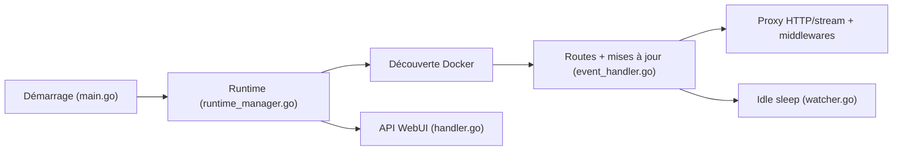

# yusing/godoxy

> Reverse proxy en Go avec interface web, découverte de conteneurs Docker et gestion Proxmox, pour homelabs.

## Le problème
Exposer plusieurs services de conteneurs derrière des noms de domaine et des certificats demande un proxy configuré en continu.

## Ce que ça fait vraiment
Il liste les conteneurs Docker ou Podman, lit leurs labels (`proxy.aliases`) et crée des routes automatiquement, avec rechargement à chaud. Il propose proxy HTTP, redirection TCP/UDP, SSO OpenID Connect, ForwardAuth, middlewares, règles d'accès IP/pays, certificats Let's Encrypt (DNS-01), métriques, journaux et uptime dans l'interface web. Il sait mettre en veille et réveiller des conteneurs Docker ou LXC Proxmox selon le trafic.

## Comment c'est branché


## Essayer
```bash
/bin/sh -c "$(curl -fsSL https://raw.githubusercontent.com/yusing/godoxy/main/scripts/setup.sh)"
docker compose up -d
```

## Coût et pièges
Gratuit ; enregistrements DNS wildcard à créer, fonctionnement en réseau `host` obligatoire. Les règles par pays demandent un compte MaxMind. Licence non identifiée par GitHub. Le script de configuration se télécharge et s'exécute via curl.

## Ce que ce n'est pas
Pas un contrôleur Kubernetes ni un service mesh. Plusieurs fonctions (Proxmox, SSO) reposent sur la doc du README, non vérifiée dans le code ici.

## Alternatives
Non documenté dans le README (le terme NPM est cité comme analogie pour les routes).

## Pour toi
À surveiller pour un serveur perso hébergeant des services ML ; vérifie la licence avant tout usage professionnel.

