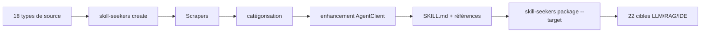

# yusufkaraaslan/Skill_Seekers

> Transforme docs, dépôts, PDF, vidéos et wikis en skills d'agent ou en corpus RAG.

## Le problème
Préparer la même documentation pour Claude, pour un index vectoriel et pour l'IA de
l'IDE oblige à la re-scraper et la re-formater trois fois.

## Ce que ça fait vraiment
Dix-huit types de source en entrée (site de doc, dépôt GitHub, base de code locale,
PDF, Word, EPUB, Jupyter, OpenAPI, PowerPoint, AsciiDoc, HTML, RSS, page de manuel,
vidéo YouTube/Vimeo/locale, Confluence, Notion, exports Slack/Discord) et 22 cibles
en sortie (12 plateformes LLM dont `claude`, `gemini`, `openai` ; 8 cibles RAG et
vecteurs : LangChain, LlamaIndex, Haystack, Chroma, FAISS, Weaviate, Qdrant,
Pinecone ; plus `atlas` et `ibm-bob`). Découverte en trois couches pour les sites
SPA (`sitemap.xml` → `llms.txt` → navigateur headless). Le pipeline C3.x analyse une
base de code par AST, détecte 10 patrons GoF sur 9 langages, extrait des exemples
depuis les tests. Enrichissement IA en mode API ou en mode LOCAL via un agent CLI
(sans coût d'API). Serveur MCP à 40 outils, installation automatique dans 19 agents,
index de recherche SQLite FTS5 optionnel dans le skill.

## Comment c'est branché


## Essayer
```bash
pip install skill-seekers
skill-seekers create https://docs.djangoproject.com/
skill-seekers package output/django --target claude
skill-seekers scan ./my-react-app --out ./configs/scanned/
python -m skill_seekers.mcp.server_fastmcp
```

## Coût et pièges
Le mode API facture chez Anthropic, Gemini, OpenAI, Kimi ou MiniMax ; le mode LOCAL
passe par un agent CLI déjà installé et ne coûte rien de plus. Python 3.10+ et Git.
Les extras sont nombreux (`[video]`, `[video-full]`, `[mcp]`, `[all]`) et
`--setup` installe une variante PyTorch selon le GPU. Un scrape de 500 à 2000 pages
prend 30 à 60 minutes pour ~40 Mo.

## Ce que ce n'est pas
Pas un moteur de RAG : il prépare la donnée, il ne sert pas les requêtes. Les
chiffres mis en avant (99 % plus rapide, 3 900+ tests) viennent du mainteneur. Les
métriques de lisibilité anglaises sont déclarées provisoires et n'affectent pas le
score de qualité.

## Alternatives
- Aucun dépôt alternatif nommé dans le README ; l'écosystème cité (configs, action,
  plugin, tap Homebrew) est du même auteur.

## Pour toi
Exactement l'outillage que tu construis à la main pour tes fiches : le mode LOCAL
et l'index FTS5 dans le skill valent un essai.
