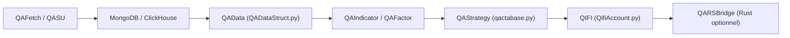

# yutiansut/QUANTAXIS

> Framework Python de finance quantitative pour marchés chinois : données, backtest, comptes, trading simulé ou réel.

## Le problème
Assembler soi-même l'ingestion de données de marché, le stockage, le backtest et la gestion de comptes multi-marchés est un chantier lourd.

## Ce que ça fait vraiment
Modules Python : récupération de données (QAFetch), sauvegarde vers MongoDB ou ClickHouse (QASU), structures de données de marché, indicateurs, facteurs, stratégies CTA, comptes au format QIFI, bus RabbitMQ et serveur Tornado. Une couche Rust optionnelle (QARS2) accélère comptes et backtest, avec repli en Python. Le README est en chinois et le paquet est en `2.1.0-alpha2`.

## Comment c'est branché


## Essayer
```bash
git clone https://github.com/QUANTAXIS/QUANTAXIS.git
cd QUANTAXIS
pip install -e .
pip install -e .[rust]
pip install -e .[full]
```

## Coût et pièges
MongoDB 4.0+ ou ClickHouse (optionnel), RabbitMQ pour la messagerie, 8 Go de RAM recommandés. Les chiffres « 100x » viennent du README, sans mesure reproduite ici.

## Ce que ce n'est pas
Pas un outil pour marchés occidentaux : les adaptateurs visent surtout les actions et futures chinois. Pas un projet stable : alpha, 240 issues ouvertes, dépendances de ~60 paquets modernisées d'un coup.

## Alternatives
Aucune alternative nommée dans le README.

## Pour toi
À ignorer sauf si tu fais du quant sur les marchés chinois : c'est une alpha portée par une seule personne, et rien dans le README ne prouve la fiabilité des chiffres avancés.

