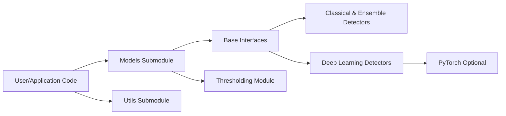

# yzhao062/pyod

> Bibliothèque Python de détection d'anomalies : 61 détecteurs tabulaires, séries temporelles, graphes, texte, audio.

## Le problème
Chaque méthode de détection d'anomalies a sa propre implémentation et son API ; comparer et choisir un détecteur prend du temps.

## Ce que ça fait vraiment
API unique `fit` / `decision_function` / `predict` / `predict_proba` pour IForest, ECOD, LOF, AutoEncoder, DeepSVDD…
Séries temporelles (KShape, MatrixProfile, LSTMAD), graphes PyG (DOMINANT, CoLA), audio, texte/image via `EmbeddingOD`.
`ADEngine` choisit, compare et évalue les détecteurs ; skill `od-expert` pour Claude Code/Codex et serveur MCP à 10 outils.
Accélération SUOD et numba ; utilitaires de données synthétiques et d'évaluation (ROC, P@n).

## Comment c'est branché


## Essayer
```bash
pip install pyod
pyod install skill
pip install pyod[mcp]
pyod mcp serve
pyod info
```

## Coût et pièges
Gratuit, BSD-2. Les extras graphe/audio/MCP sont optionnels ; `OpenAIEncoder` implique une clé à ta charge. Détecteurs graphe et MatrixProfile transductifs (pas de `predict` hors échantillon).

## Ce que ce n'est pas
Pas un service de monitoring ni un système d'alerte : une bibliothèque. Les outils MCP stateful (`investigate`) sont reportés.

## Alternatives
- PyGOD : dédié aux graphes.
- TODS : dédié aux séries temporelles.
- ADBench : pour benchmarker plutôt que détecter.

## Pour toi
À adopter : référence de la détection d'anomalies en Python, API scikit-learn familière, et ADEngine accélère le choix du détecteur sur un nouveau jeu.
