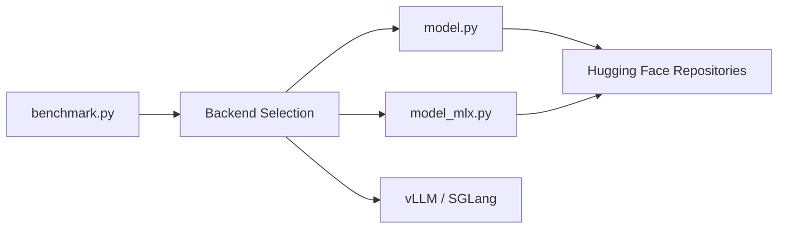

# z-lab/dflash

> Modèles brouillons par diffusion de blocs pour accélérer le décodage spéculatif des LLM.

## Le problème
La génération autorégressive produit un jeton à la fois ; les brouillons classiques du décodage spéculatif restent séquentiels et limitent le gain.

## Ce que ça fait vraiment
Un petit modèle propose un bloc de jetons en parallèle, le modèle cible le vérifie et garde les jetons acceptés.
Checkpoints publics pour Qwen3.x, Gemma 4, Kimi, GPT-OSS, Llama-3.1-8B, etc.
Backends locaux Transformers (Linux) et MLX (Apple Silicon) ; sinon via serveur OpenAI-compatible vLLM ou SGLang.
CLI de benchmark commune (gsm8k, math500, humaneval, mbpp, mt-bench).

## Comment c'est branché


## Essayer
```bash
pip install dflash
pip install "dflash[local]"
dflash generate openai --base-url http://127.0.0.1:8000 --model Qwen/Qwen3.8-27B "How many positive whole-number divisors does 196 have?"
dflash benchmark openai --base-url http://127.0.0.1:8000 --model Qwen/Qwen3.8-27B --dataset gsm8k --num-prompts 128
```

## Coût et pièges
Gratuit, mais cibles de 27B à 397B : gros GPU ou Mac bien doté. Le serveur vLLM/SGLang s'installe à part.

## Ce que ce n'est pas
Pas un serveur d'inférence : le dépôt ne fournit que le brouillon et le banc d'essai. Chaque modèle cible exige son checkpoint dédié.

## Alternatives
Aucune alternative nommée dans le README (vLLM, SGLang, llama.cpp sont des hôtes, pas des concurrents).

## Pour toi
À surveiller : si tu sers des LLM ouverts sur vLLM, c'est un levier de latence potentiel à mesurer sur ton modèle avant d'y croire.
