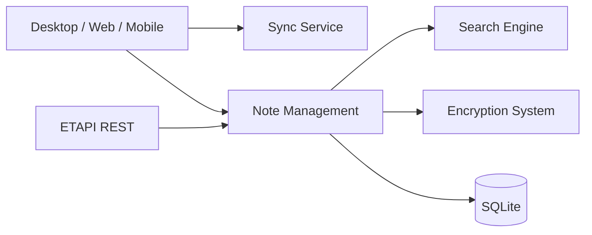

# zadam/trilium

> Application de prise de notes hiérarchique, auto-hébergeable, pour bâtir de grandes bases de connaissances personnelles.

## Le problème
Les notes plates ne tiennent pas des dizaines de milliers d'entrées ; les outils SaaS enferment les données.

## Ce que ça fait vraiment
Notes en arbre (une note peut être clonée à plusieurs endroits), éditeur WYSIWYG, notes de code, versionnage, attributs pour requêter et scripter, chiffrement par note, synchronisation avec un serveur auto-hébergé, API REST, partage public, canevas Excalidraw, cartes mentales et géographiques. Le README indique tenir au-delà de 100 000 notes. Le dépôt a été confié à la communauté TriliumNext ; le README est celui de ce successeur.

## Comment c'est branché


## Essayer
```bash
git clone https://github.com/TriliumNext/Trilium.git
cd Trilium
pnpm install
pnpm run server:start
```
(installation utilisateur : binaire de la page des releases, à décompresser puis lancer `trilium`.)

## Coût et pièges
Gratuit. Après v0.90.4, la synchronisation n'est plus compatible avec zadam/trilium v0.63.7 ; les clients mobiles doivent avoir la même version de sync que le serveur.

## Ce que ce n'est pas
Pas un éditeur Markdown pur ni un outil collaboratif temps réel (non documenté). L'application mobile officielle n'existe pas : ce sont des projets tiers.

## Alternatives
TriliumNext/Trilium (successeur actif) ; le README cite Evernote, OneNote, Google Keep, Notion, Obsidian et Anytype comme sources d'import.

## Pour toi
À adopter pour une base de connaissances personnelle auto-hébergée ; licence AGPL à connaître si tu veux le modifier et l'exposer.
