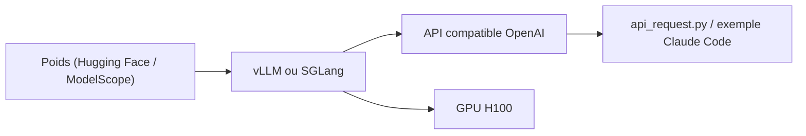

# zai-org/GLM-4.5

> Modèles GLM-4.5 à 4.7 de Zhipu (Z.ai) : poids ouverts, code de service et exemples d'inférence.

## Le problème
Servir localement de grands modèles de raisonnement et d'agents, avec appel d'outils et mode de réflexion.

## Ce que ça fait vraiment
Le dépôt présente la famille GLM-4.7, 4.6 et 4.5 (355B-A32B, Air 106B-A12B, Flash 30B-A3B), les liens de téléchargement (Hugging Face, ModelScope), les configurations GPU minimales et des commandes de service avec vLLM et SGLang (parsers d'outils et de raisonnement, décodage spéculatif). Il contient des scripts d'inférence (`trans_infer_cli.py`, `api_request.py`) et un exemple Claude Code.

## Comment c'est branché


## Essayer
```bash
vllm serve zai-org/GLM-4.7-FP8 \
     --tensor-parallel-size 4 \
     --speculative-config.method mtp \
     --speculative-config.num_speculative_tokens 1 \
     --tool-call-parser glm47 \
     --reasoning-parser glm45 \
     --enable-auto-tool-choice \
     --served-model-name glm-4.7-fp8
```

## Coût et pièges
Matériel lourd : GLM-4.5 en FP8 demande 8 H100 et plus d'1 To de RAM serveur ; seul GLM-4.7-Flash tient sur 1 H100 en BF16. Mode « Preserved Thinking » pris en charge par SGLang seulement.

## Ce que ce n'est pas
Pas le code d'entraînement complet : c'est un dépôt d'inférence et de documentation. Les chiffres de benchmark viennent des auteurs.

## Alternatives
Aucune alternative nommée dans le README (l'API hébergée Z.ai est citée).

## Pour toi
À surveiller : GLM-4.7-Flash est le point d'entrée réaliste pour un essai local ; les grands modèles dépassent le budget d'une équipe sans cluster.
