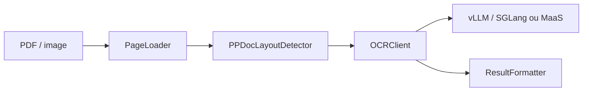

# zai-org/GLM-OCR

> Modèle OCR de 0,9 milliard de paramètres et SDK pour lire des documents complexes.

## Le problème
Extraire texte, tableaux et formules de documents réels avec un modèle léger et déployable.

## Ce que ça fait vraiment
Pipeline en deux temps : détection de mise en page (PP-DocLayout-V3) puis reconnaissance en parallèle, sortie Markdown ou JSON. SDK Python et CLI, service Flask, déploiement via vLLM, SGLang, Ollama ou MLX. Le README revendique 94,62 sur OmniDocBench V1.5 (mesure des auteurs). Mode cloud MaaS Zhipu sans GPU.

## Comment c'est branché


## Essayer
```bash
pip install glmocr
pip install "glmocr[selfhosted]"
glmocr parse examples/source/code.png
python -m glmocr.server
```

## Coût et pièges
Le mode MaaS demande une clé sur open.bigmodel.cn (facturation non détaillée). L'auto-hébergement suppose un GPU et vLLM ≥ 0.19 ou SGLang ≥ 0.5.10.

## Ce que ce n'est pas
Ne remplace pas une vérification humaine des extractions critiques.

## Alternatives
Aucune alternative nommée dans le README.

## Pour toi
Adopter : OCR documentaire léger, déployable en local, pertinent pour des pipelines RAG et d'extraction ; tester sur tes propres documents.

