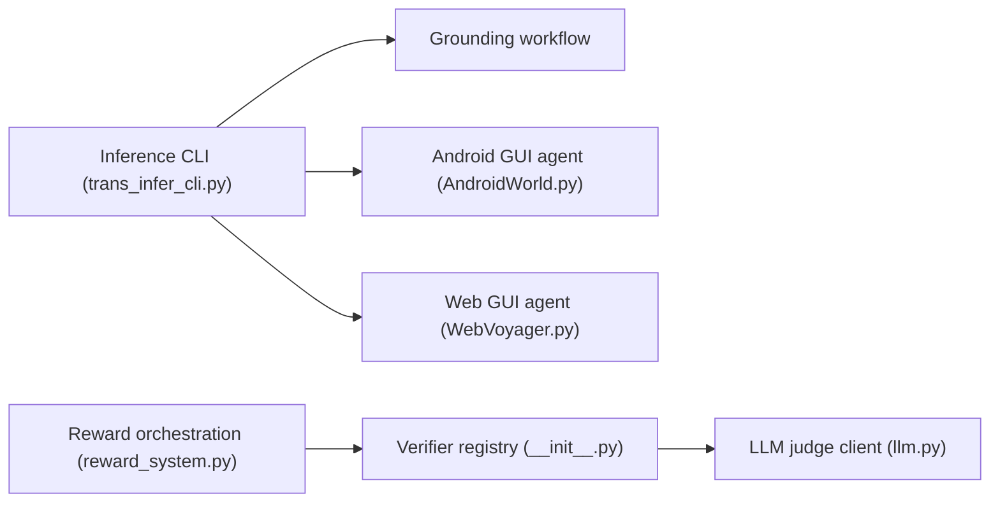

# zai-org/GLM-V

> Modèles vision-langage ouverts GLM-4.6V, 4.5V et 4.1V, avec exemples d'agents GUI et de grounding.

## Le problème
Les modèles multimodaux ouverts raisonnent mal sur les documents longs, les interfaces et la localisation précise d'objets.

## Ce que ça fait vraiment
Le dépôt regroupe les liens vers les modèles (GLM-4.6V de 106B, 4.6V-Flash de 9B, 4.5V, 4.1V-9B-Thinking), de la documentation de grounding et d'agents GUI, une application de bureau, un système de récompense à vérificateurs et des skills (PDF vers slides ou web, capture d'image, filtrage de CV). L'implémentation des modèles est dans Transformers. Déploiement via SGLang, vLLM ou Transformers.

## Comment c'est branché

## Essayer
Aucune commande d'installation dans le README. Déploiement via SGLang, vLLM ou Transformers : voir les recettes citées.

## Coût et pièges
GPU requis pour les gros modèles ; GGUF disponibles sur Hugging Face pour des tailles réduites. Limites reconnues : réflexion répétitive, QA textuelle à améliorer, comptage et identification imparfaits.

## Ce que ce n'est pas
Pas le code des modèles : il vit dans Transformers. Les chiffres de benchmark sont ceux des auteurs.

## Alternatives
- Qwen-2.5-VL-72B : cité comme modèle surpassé sur 18 tâches.

## Pour toi
À surveiller : famille VLM ouverte sous Apache-2.0 avec déploiement standard ; à comparer sur tes propres données.

