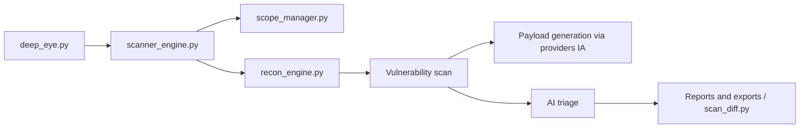

# zakirkun/deep-eye

> Scanner de vulnérabilités web piloté par IA, pour équipes de test d'intrusion autorisé.

## Le problème
Un audit web enchaîne reconnaissance, dizaines de contrôles, tri des faux positifs et rédaction de rapports : long et répétitif à la main.

## Ce que ça fait vraiment
- Prend une URL cible, fait de la reconnaissance et un balayage borné par un périmètre (`scope_manager.py`, option `--scope-nl` en langage naturel).
- Lance plus de 50 contrôles de vulnérabilités, avec des charges générées par un modèle d'IA parmi une dizaine de fournisseurs (ou Ollama en local).
- Trie les résultats par IA, dédoublonne, produit des rapports (HTML, PDF, JSON, SARIF, JUnit, CSV, XLSX) avec correspondance PCI-DSS, SOC2, ISO 27001.
- Compare deux scans (`scan_diff.py`) et ne garde que les nouveaux constats au retest.

## Comment c'est branché


## Essayer
```bash
pip install -r requirements.txt
cp config/config.example.yaml config/config.yaml   # renseigner les clés d'API
python deep_eye.py -u https://target.com
python deep_eye.py --diff baseline.json current.json --diff-format html --diff-output diff_report.html
```

## Coût et pièges
Au moins une clé d'API d'un fournisseur d'IA (facturée à l'usage) ou un Ollama local. Licence présente mais non identifiée par GitHub : à vérifier avant tout usage en entreprise.

## Ce que ce n'est pas
Ce n'est pas un outil à pointer sur un système tiers : le README précise un usage réservé aux tests autorisés, sur systèmes dont on est propriétaire ou avec autorisation écrite ; tout accès non autorisé est illégal. Un scanner assisté par IA ne remplace pas la validation humaine des constats.

## Alternatives
Les modèles de type Nuclei (cités pour le format de templates YAML) : écosystème plus établi pour des contrôles déclaratifs.

## Pour toi
Surveiller : pertinent si tu fais des audits autorisés et veux voir l'orchestration multi-LLM, mais projet jeune, mainteneur unique et licence floue.

