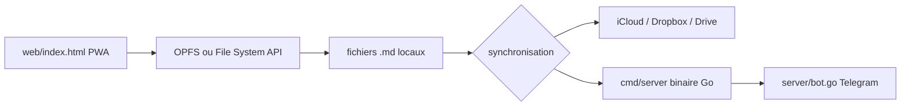

# zakirullin/files.md

> Application web locale qui gère notes, journal, tâches et listes en fichiers `.md`.

## Le problème
Les outils de prise de notes enferment le contenu dans leur format et leurs greffons.
Le système grossit, et le travail de pensée est repoussé à un futur soi qui n'arrive jamais.

## Ce que ça fait vraiment
Tout est stocké en `.md` en local, dans le navigateur ; les fichiers ne quittent pas l'appareil par défaut.
Un flux de chat (`Cmd+Enter`) pour déposer une pensée, puis la ranger vers une note, le journal ou une liste.
Une structure de dossiers prédéfinie : `brain/`, `journal/YYYY.MM Mois.md`, `Later.md`, `habits/`.
Pas de build, pas d'Electron : `web/index.html` s'ouvre directement ; la synchronisation est optionnelle.

## Comment c'est branché


## Essayer
```
go run /abs/path/to/files.md/cmd/backlink/backlink.go
```
L'usage principal ne s'installe pas : ouvrir app.files.md, puis « Install files.md » dans la barre d'adresse.

## Coût et pièges
Gratuit. Les navigateurs Chromium sont les seuls à bien gérer l'API File System d'après l'auteur.
La synchronisation hébergée passe par `api.files.md`, un service du mainteneur : c'est une dépendance externe.

## Ce que ce n'est pas
Pas un Obsidian : le projet argumente contre les greffons, les gabarits et le « second cerveau ».
Pas un outil d'équipe — tout est pensé pour un usage personnel local.
Une bonne moitié du README est un essai sur la prise de notes, pas de la documentation.

## Alternatives
Obsidian, cité dans le README comme la référence dont le projet se démarque.

## Pour toi
Intéressant pour la discipline « une idée par note » ; le code minimal est lisible si tu veux le bricoler.
