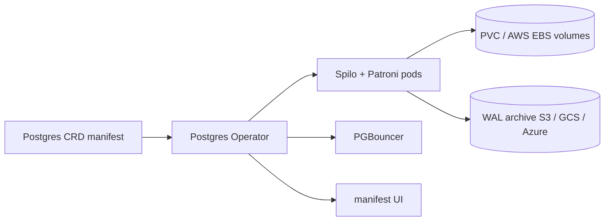

# zalando/postgres-operator

> **A Kubernetes operator that runs replicated PostgreSQL clusters declared as CRD manifests.**

## The problem

Running PostgreSQL with high availability on Kubernetes means orchestrating replication,
failover, upgrades and backups by hand. The README frames the opposite approach: everything
goes through Postgres manifests, with no direct access to the Kubernetes API, so the database
fits CI/CD pipelines instead of manual operations.

## What it actually does

It deploys streaming-replication PostgreSQL clusters via Patroni, driven by CRDs. The README
lists: rolling updates on cluster changes, including quick minor version updates; live volume
resize without pod restarts (AWS EBS, PVC); connection pooling with PGBouncer; in-place major
version upgrades, including a global upgrade of all clusters; pod protection during bootstrap
and configurable maintenance windows; restore and cloning on AWS, GCS and Azure; logical
backups to an S3 or GCS bucket; standby clusters from an S3/GCS WAL archive or a remote host;
basic credential and user management; custom TLS certificates; a UI to create and edit
manifests; OpenShift compatibility and multi-arch support. On the database side: PostgreSQL 18,
starting from 14+, point-in-time recovery with pg_basebackup / WAL-G or WAL-E via Spilo,
preloaded libraries (bg_mon, pg_stat_statements, pgextwlist, pg_auth_mon) and bundled
extensions such as pg_cron, pg_partman, pgvector, postgis and timescaledb.

## How it is wired

No diagram exists in the catalogue for this repository; the graph below is rebuilt from the
README alone.



The entry point is the CRD manifest, the only configuration surface the README declares. The
operator drives Postgres clusters built on Spilo and Patroni, storage on PVC or EBS that can
be resized live, WAL archives used for restore, cloning and standby clusters, PGBouncer for
pooling, and the manifest editing UI.

## Trying it

```bash
# No command appears in the README: it points to the tutorial at docs/quickstart.md
# and to the deployment options in docs/quickstart.md#deployment-options.
```

The README carries no installation command and no runnable example — everything is deferred to
the repository docs and to postgres-operator.readthedocs.io.

## Cost and gotchas

The code is MIT licensed, so the operator itself costs nothing. A Kubernetes cluster is
required: the README asks for 1.27+ across every listed release and pairs Postgres and Golang
versions in a table (v2.0.2: Postgres 14→18). Backup, restore, cloning and standby features
rely on third-party object storage — S3, GCS or Azure — hence a cloud account and its bill.
Upgrade gotcha: moving from v1 to v2 requires reading docs/migrate.md before deploying, which
the README states explicitly.

## What it is not

It is not a managed database: the operator automates operations, but the Kubernetes cluster,
the storage and the bill stay yours. It is not a PostgreSQL distribution either — replication
comes from Patroni, the image from Spilo, backups from WAL-G or WAL-E. It cannot be used
outside Kubernetes, and non-cloud usage is only described as "configurable for non-cloud
environments", with no detail in the README.

## Alternatives

cloudnative-pg/cloudnative-pg is the other PostgreSQL operator for Kubernetes in the
catalogue: same ground, to be decided on ecosystem and governance rather than on the README.
The other neighbours (etcd-io/etcd, gravitational/teleport, VictoriaMetrics/VictoriaMetrics)
are not comparable: a key-value store, an infrastructure access layer and a time-series
database respectively.

## Why it matters to you

Relevant if your data workloads need self-hosted PostgreSQL on Kubernetes, with pgvector among
the listed extensions. Developed at Zalando and, according to the README, used in production
for over five years — a serious option to watch as soon as you host the Postgres layer
yourself instead of renting it.
