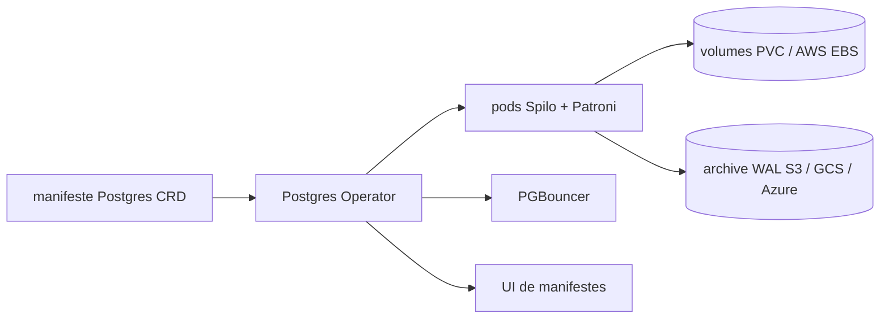

# zalando/postgres-operator

> **Un opérateur Kubernetes qui gère des clusters PostgreSQL répliqués déclarés en manifestes CRD.**

## Le problème

Faire tourner PostgreSQL en haute disponibilité sur Kubernetes demande d'orchestrer à la main
la réplication, les bascules, les mises à jour et les sauvegardes. Le README pose le cadre
inverse : tout passer par des manifestes Postgres, sans accès direct à l'API Kubernetes, pour
intégrer la base à des pipelines CI/CD plutôt qu'à des opérations manuelles.

## Ce que ça fait vraiment

Il déploie des clusters PostgreSQL en réplication en flux via Patroni, à partir de CRD.
Le README liste : mises à jour progressives sur changement du cluster, y compris les montées
de version mineures ; redimensionnement de volume à chaud sans redémarrage de pod (AWS EBS,
PVC) ; pooling de connexions avec PGBouncer ; montée de version majeure en place, y compris
globale sur tous les clusters ; protection des pods pendant le bootstrap et fenêtres de
maintenance configurables ; restauration et clonage sur AWS, GCS et Azure ; sauvegardes
logiques vers S3 ou GCS ; cluster standby depuis une archive WAL S3/GCS ou un hôte distant ;
gestion de base des identifiants et des utilisateurs ; certificats TLS personnalisés ; une UI
pour créer et éditer les manifestes. Côté Postgres : PostgreSQL 18, à partir de 14+, PITR avec
pg_basebackup / WAL-G ou WAL-E via Spilo, et des extensions préchargées (bg_mon,
pg_stat_statements, pgextwlist, pg_auth_mon) ou embarquées (pg_cron, pg_partman, pgvector,
postgis, timescaledb, entre autres).

## Comment c'est branché

Pas de diagramme dans le catalogue pour ce dépôt ; le schéma ci-dessous est reconstruit
depuis le README seul.



L'entrée est le manifeste CRD, seul point de configuration déclaré. L'opérateur pilote les
clusters Postgres fournis par Spilo et Patroni, le stockage en PVC ou EBS redimensionnable à
chaud, les archives WAL pour la restauration, le clonage et les clusters standby, PGBouncer
pour le pooling, et l'UI d'édition des manifestes.

## Essayer

```bash
# Aucune commande n'est donnée dans le README : il renvoie au tutoriel docs/quickstart.md
# et aux options de déploiement de docs/quickstart.md#deployment-options.
```

Le README ne contient aucune commande d'installation ni d'exemple exécutable — tout est
délégué à la documentation du dépôt et à postgres-operator.readthedocs.io.

## Coût et pièges

Le code est sous licence MIT, rien à payer pour l'opérateur. Il faut en revanche un cluster
Kubernetes : le README exige 1.27+ pour toutes les versions listées, et croise versions
Postgres et Golang dans un tableau (v2.0.2 : Postgres 14→18). Les fonctions de sauvegarde,
restauration, clonage et standby reposent sur du stockage objet tiers — S3, GCS ou Azure —
donc sur un compte cloud et sa facture. Piège de montée de version : passer de v1 à v2 impose
de lire docs/migrate.md avant déploiement, le README le signale explicitement.

## Ce que ce n'est pas

Ce n'est pas une base managée : l'opérateur automatise l'exploitation, mais le cluster
Kubernetes, le stockage et les coûts restent à ta charge. Ce n'est pas non plus une
distribution PostgreSQL — la réplication vient de Patroni, l'image de Spilo, les sauvegardes
de WAL-G ou WAL-E. Ce n'est pas utilisable hors Kubernetes, et l'usage hors cloud n'est
présenté que comme « configurable pour les environnements non-cloud », sans détail dans le
README.

## Alternatives

cloudnative-pg/cloudnative-pg est l'autre opérateur PostgreSQL pour Kubernetes du catalogue :
même terrain, à départager sur l'écosystème et le modèle de gouvernance plutôt que sur le
README. Les autres voisins (etcd-io/etcd, gravitational/teleport,
VictoriaMetrics/VictoriaMetrics) ne sont pas comparables : ce sont respectivement un magasin
clé-valeur, un accès infrastructure et une base de séries temporelles.

## Pour toi

Utile si tes charges data ont besoin de PostgreSQL sur Kubernetes en self-hosted, avec
pgvector disponible dans les extensions listées. Développé chez Zalando et, d'après le README,
en production depuis plus de cinq ans — donc une base à surveiller sérieusement dès que tu
héberges toi-même la couche Postgres plutôt que de la louer.
