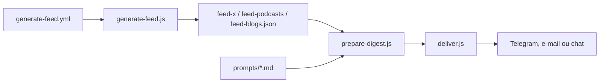

# zarazhangrui/follow-builders

> Compétence d'agent (Claude Code ou OpenClaw) qui envoie un digest de podcasts, posts X et blogs d'IA.

## Le problème
Suivre les propos des personnes qui construisent réellement en IA, sans passer par les relais d'influence.

## Ce que ça fait vraiment
Un flux central quotidien (GitHub Actions) agrège des blogs par scraping, des transcriptions YouTube via Supadata et des posts X par l'API officielle ; l'agent local le récupère, le résume avec des fichiers de prompts en anglais simple, traduit au besoin et livre par Telegram, e-mail ou dans le chat. Sources par défaut : 6 podcasts, 26 comptes X, 2 blogs.

## Comment c'est branché


## Essayer
```bash
git clone https://github.com/zarazhangrui/follow-builders.git ~/.claude/skills/follow-builders
cd ~/.claude/skills/follow-builders/scripts && npm install
```
Puis dire à l'agent « set up follow builders » ou invoquer `/follow-builders`.

## Coût et pièges
Aucune clé d'API à fournir, mais tout dépend du flux central de l'auteur : s'il s'arrête, le digest s'arrête. Aucune licence déclarée. Les clés Telegram ou e-mail restent en local dans `~/.follow-builders/.env`.

## Ce que ce n'est pas
Pas une veille personnalisable côté sources : la liste est gérée centralement et se met à jour seule.

## Alternatives
Aucune alternative nommée dans le README.

## Pour toi
À surveiller : pratique pour une veille IA prête à l'emploi dans Claude Code, mais sans licence et suspendue à un flux central tenu par une seule personne.

