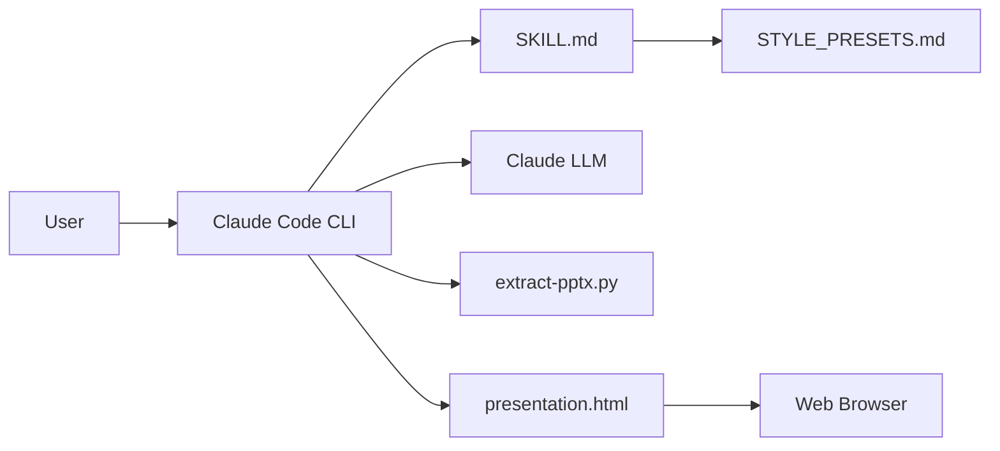

# zarazhangrui/frontend-slides

> Skill pour agents de code qui génère des présentations HTML autonomes ou convertit des PPTX.

## Le problème
Produire un deck soigné sans savoir coder CSS/JS ni formuler ses goûts visuels prend du temps et donne souvent un rendu générique.

## Ce que ça fait vraiment
Un `SKILL.md` guide l'agent : recueil du contenu, trois aperçus de styles, choix, puis génération d'un fichier HTML unique (CSS/JS inline, 16:9).
Styles issus de `STYLE_PRESETS.md` (12 presets) et d'un pack de 34 templates chargés progressivement.
Conversion PPTX via `scripts/extract-pptx.py` (python-pptx).
Scripts de partage : déploiement Vercel et export PDF via Playwright.

## Comment c'est branché


## Essayer
```bash
git clone https://github.com/zarazhangrui/frontend-slides.git ~/.claude/skills/frontend-slides
bash scripts/deploy.sh ./presentation.html
bash scripts/export-pdf.sh ./presentation.html ./output.pdf
```

## Coût et pièges
Gratuit, mais consomme les tokens de ton agent. PPTX : python-pptx ; déploiement : Node.js + compte Vercel ; PDF : Node.js.

## Ce que ce n'est pas
Pas un éditeur de slides : tout passe par l'agent. L'export PDF perd les animations. La qualité dépend du LLM utilisé.

## Alternatives
Aucune alternative nommée dans le README (seul `beautiful-html-templates` est cité comme source de templates).

## Pour toi
Surveiller : utile pour des decks rapides hors charte graphique ; pour une présentation qui doit suivre une charte, un générateur dédié reste préférable.
