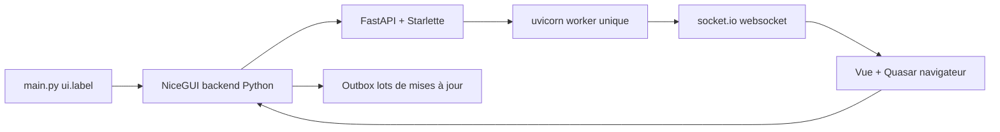

# zauberzeug/nicegui

> Framework d'UI Python qui s'affiche dans le navigateur, du bouton à la scène 3D.

## Le problème
Mettre une interface sur un script Python — régler un algorithme, piloter un robot —
oblige sinon à écrire du front séparé ou à subir la gestion d'état magique d'autres
frameworks.

## Ce que ça fait vraiment
Éléments standards (label, bouton, case, slider, saisie, upload), regroupement en
lignes, colonnes, cartes et dialogues, Markdown et HTML général. Éléments de haut
niveau : graphiques, scènes 3D, joysticks virtuels, annotation et superposition
d'images, tables, arbres repliables, vidéo et audio. Timer intégré jusqu'à 10 ms,
data binding et fonctions rafraîchissables, notifications et menus, pages partagées
ou par utilisateur, persistance par utilisateur, routes personnalisées, capture
clavier globale, thème par couleurs primaire/secondaire/accent, autocomplétion
Tailwind, framework de test basé sur pytest. Rechargement implicite à chaque
modification du code, mode serveur ou mode natif fenêtre de bureau, fonctionne dans
Jupyter.

## Comment c'est branché


## Essayer
```bash
python3 -m pip install nicegui
python3 main.py
docker run -p 8080:8080 zauberzeug/nicegui
```

## Coût et pièges
Gratuit, rien à créer comme compte. Un seul worker uvicorn : toute la logique tient
dans un processus asynchrone, donc un traitement bloquant gèle l'UI de tous les
clients. La communication passe par une websocket ouverte en permanence après le
chargement de la page.

## Ce que ce n'est pas
Pas un framework web généraliste ni un remplaçant de front applicatif : c'est fait
pour des micro-applications, tableaux de bord, robotique, domotique. Pas de
scalabilité multi-processus par conception.

## Alternatives
- Streamlit : plus simple, mais « trop de magie » sur l'état selon les auteurs.
- JustPy : l'approche qui a inspiré NiceGUI, jugée trop proche du HTML.

## Pour toi
Le bon outil quand il faut une interface autour d'un modèle ou d'un script sans
sortir de Python. Le fichier `nicegui/llms.md` livré avec le paquet aide un agent.
