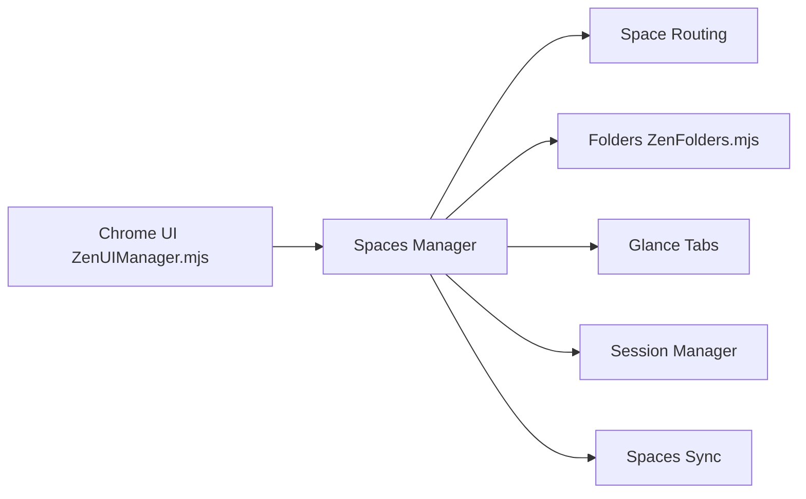

# zen-browser/desktop

> Navigateur bâti sur Firefox pour organiser onglets et espaces de travail, pour utilisateurs de bureau.

## Le problème
Beaucoup d'onglets ouverts en même temps : le README ne détaille pas le problème, seulement l'objectif de productivité.

## Ce que ça fait vraiment
README minimal (moins de 800 caractères) : navigateur fondé sur Firefox, versions Release (Firefox 156.0) et Twilight. D'après l'architecture décrite : espaces (Spaces) et routage, onglets épinglés, dossiers, vues scindées, Glance, bibliothèque, boosts de sites, dossiers en direct, gestion de session, favoris par espace, synchronisation et partage.

## Comment c'est branché


## Essayer
```bash
# Aucune commande documentée : téléchargement depuis le site du projet
```

## Coût et pièges
Gratuit. Licence MPL-2.0 (copyleft au niveau des fichiers). Les détails d'installation et de confidentialité sont hors du README.

## Ce que ce n'est pas
Pas un moteur de navigation indépendant : il suit les versions de Firefox. Le README ne dit rien de plus.

## Alternatives
- Aucune alternative nommée dans le README.

## Pour toi
Ignorer : un navigateur de confort n'entre pas dans un flux data/IA/MLOps, et la matière du README est trop mince pour argumenter.

