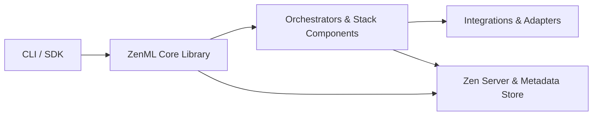

# zenml-io/zenml

> Framework MLOps qui exécute des pipelines ML et agents sur n'importe quelle infrastructure, pour ingénieurs ML en entreprise.

## Le problème
Les workflows ML et LLM sont difficiles à reproduire, suivre et déployer d'un environnement à l'autre.

## Ce que ça fait vraiment
On écrit des pipelines et steps Python avec `@pipeline` et `@step`. ZenML les conteneurise, suit chaque run (métriques, logs, métadonnées, artefacts) et les envoie sur une « stack » : orchestrateur, artifact store, intégrations (MLflow, SageMaker, Vertex, LangGraph, Langfuse). Un serveur avec tableau de bord centralise les métadonnées.

## Comment c'est branché


## Essayer
```bash
pip install "zenml[server]"
zenml init
zenml login
```

## Coût et pièges
Gratuit en open source. Un serveur distant est nécessaire en production ; l'infrastructure (Kubernetes, stockage objet) reste à ta charge. Le client léger s'installe avec `pip install zenml`.

## Ce que ce n'est pas
Ce n'est pas un outil d'observabilité LLM comme Langfuse ni un simple tracker d'expériences comme MLflow : il orchestre le cycle complet. Pour les agents, le README renvoie vers le projet frère Kitaru.

## Alternatives
- MLflow : suivi d'expériences seul.
- Langfuse / LangSmith : observabilité des applications LLM.
- Kitaru : évaluation par rejeu pour agents.

## Pour toi
À adopter si tu industrialises des pipelines ML et LLM : projet ancien (2020), actif, Apache-2.0, qui s'intègre à ce que tu utilises déjà.
