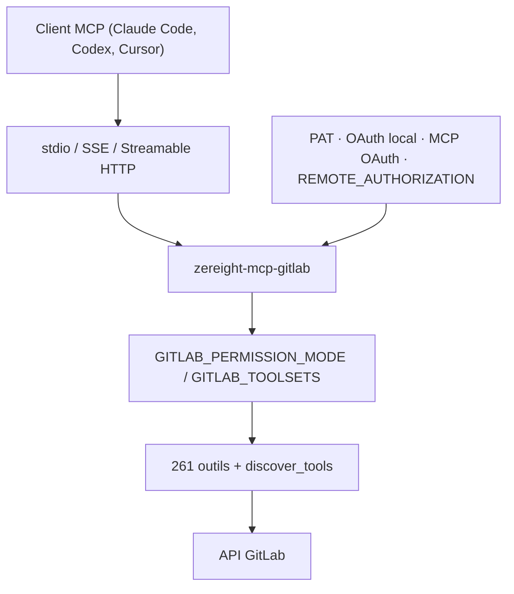

# zereight/gitlab-mcp

> Serveur MCP GitLab à 261 outils, optimisé pour les flux de travail d'agents.

## Le problème
Un agent qui doit relire une merge request, suivre un pipeline ou classer une issue GitLab n'a
pas d'accès structuré : il faut écrire les appels API à la main.

## Ce que ça fait vraiment
Couvre projets, merge requests, issues, pipelines, wiki, releases, tags, milestones. Le parti
pris est l'inverse du regroupement : 261 outils granulaires plus un `discover_tools` qui active
des lots à l'exécution, pour démarrer avec un petit contexte. La revue de MR se fait en deux
temps — `list_merge_request_changed_files` puis des `get_merge_request_file_diff` par lots.
Quatre méthodes d'authentification : jeton personnel, OAuth2 en navigateur local, proxy OAuth
MCP pour les clients distants comme Claude.ai, et autorisation distante où chaque appelant
fournit son jeton en en-tête. Trois transports : stdio, SSE, Streamable HTTP. Filtrage fin par
`GITLAB_PERMISSION_MODE` (`readonly`, `modify` sans suppression, `full`), par toolsets, par
liste blanche d'outils ou par regex de refus. Une Agent Skill est embarquée dans
`skills/gitlab-mcp/`.

## Comment c'est branché


## Essayer
```bash
brew tap zereight/gitlab-mcp https://github.com/zereight/gitlab-mcp
brew install zereight/gitlab-mcp/zereight-mcp-gitlab
npm install -g @zereight/mcp-gitlab
npx -y @zereight/mcp-gitlab@2.1.63
zereight-mcp-gitlab auth
docker run -i --rm -e HOST=0.0.0.0 -e STREAMABLE_HTTP=true -e REMOTE_AUTHORIZATION=true -p 3333:3002 zereight050/gitlab-mcp
```

## Coût et pièges
MIT, Node ≥ 18.17. Le déploiement distant est le sujet délicat : `GITLAB_OAUTH_REDIRECT_URI`
ne concerne que l'OAuth local, et corriger un `Unregistered redirect_uri` distant passe par
`GITLAB_OAUTH_CALLBACK_PROXY=true`, pas par cette variable — le README insiste. Le mode MCP
OAuth exige une application OAuth GitLab pré-enregistrée, car GitLab restreint les
applications enregistrées dynamiquement au scope `mcp`, insuffisant. `REMOTE_AUTHORIZATION`
est incompatible avec SSE. Limites par défaut : 60 requêtes/minute, 1000 sessions, jetons
expirés après une heure d'inactivité.

## Ce que ce n'est pas
Ce n'est pas un client GitLab avec interface : c'est un serveur MCP. Ce n'est pas non plus un
outil sans risque — en mode `full` il supprime, y compris via `execute_graphql` et les actions
`delete`/`move` de `push_files`, d'où l'existence du mode `modify`.

## Alternatives
- Le « GitLab MCP A » communautaire de style CQRS, comparé dans le README : 50-60 outils
  groupés, pensé pour le multi-instance d'entreprise, souvent Node ≥ 24.

## Pour toi
Le bon choix si ton code vit sur GitLab et que tu veux un agent qui relit les MR sérieusement.
