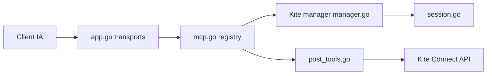

# zerodha/kite-mcp-server

> Serveur MCP donnant à un assistant IA accès au compte de trading Kite Connect de Zerodha.

## Le problème
Un assistant ne peut pas consulter un portefeuille ou passer des ordres sans interface standardisée vers l'API de courtage.

## Ce que ça fait vraiment
Expose via MCP la connexion, les cotations, l'historique, les positions, les ordres (placer, modifier, annuler), les ordres GTT et les fonds. Modes stdio, HTTP, SSE ou hybride. Une version hébergée est disponible sur `mcp.kite.trade`, sans les opérations de trading destructrices. Variable `EXCLUDED_TOOLS` pour des instances en lecture seule.

## Comment c'est branché


## Essayer
```bash
git clone https://github.com/zerodha/kite-mcp-server
cd kite-mcp-server
go build -o kite-mcp-server
./kite-mcp-server
```

## Coût et pièges
Auto-hébergement : clés Kite Connect (abonnement du courtage, non précisé) et Go 1.21+. Les ordres réels engagent de l'argent : exclure place/modify/cancel pour tester.

## Ce que ce n'est pas
Pas un conseiller financier ni un outil de backtest. L'instance hébergée ne passe pas d'ordres. Réservé aux clients Zerodha.

## Alternatives
Aucune alternative citée dans le README.

## Pour toi
À surveiller : exemple propre de MCP sur API de courtage ; ne l'active en écriture que si tu es client Zerodha.

