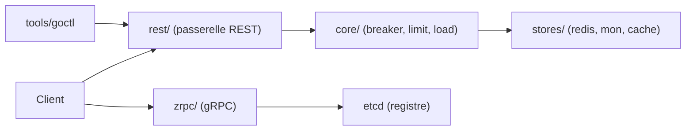

# zeromicro/go-zero

> Framework Go web et RPC avec génération de code goctl, pour services à forte charge.

## Le problème
Écrire des microservices Go oblige à recoder timeouts, limitation de débit, coupe-circuit et squelettes de projet, et à les garder cohérents entre services.

## Ce que ça fait vraiment
Un fichier .api décrit les routes ; goctl génère le serveur Go (handler, logic, svc, types) et des clients dans plusieurs langages. À l'exécution, le framework ajoute contrôle de timeout en chaîne, limitation de concurrence, coupe-circuit adaptatif et délestage de charge. Il couvre aussi REST (rest/), gRPC (zrpc/), caches Redis et MongoDB (stores/) et la découverte de services. Le README documente un flux pour assistants IA (ai-context, zero-skills, mcp-zero).

## Comment c'est branché


## Essayer
```bash
go get -u github.com/zeromicro/go-zero
go install github.com/zeromicro/go-zero/tools/goctl@latest
goctl api -o greet.api
goctl api go -api greet.api -dir greet
cd greet
go mod tidy
go run greet.go -f etc/greet-api.yaml
curl -i http://localhost:8888/greet/from/you
```

## Coût et pièges
Gratuit ; Go requis. Redis, MongoDB ou etcd ne sont nécessaires que pour les modules correspondants. Les chiffres de trafic et de benchmark du README viennent des auteurs.

## Ce que ce n'est pas
Ce n'est pas un outil data : c'est un socle de services back-end. La documentation détaillée est principalement en dehors du README.

## Alternatives
Aucune alternative citée dans le README.

## Pour toi
À surveiller : pertinent si tu écris des services Go d'inférence ou d'API, sinon hors périmètre d'un profil Python data/IA.

