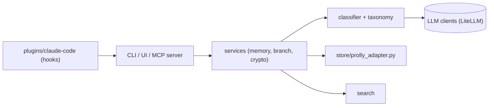

# zhangfengcdt/memoir

> Mémoire versionnée façon Git pour agents IA, avec chemins sémantiques, CLI, serveur MCP et plugins d'agents.

## Le problème
Les mémoires d'agents (`CLAUDE.md`, bases vectorielles) sont des blocs sans historique : une mauvaise session pollue tout, et chaque mise à jour invalide le cache de préfixe.

## Ce que ça fait vraiment
Stocke des souvenirs à des chemins comme `preferences.coding.style`, avec branches, commits, fusion et retour arrière, dans un magasin de type prolly-tree. Le classement automatique et le rappel sémantique passent par un LLM (Haiku 4.5 par défaut) ; lecture par chemin et recall par mots-clés fonctionnent sans LLM. Livré avec CLI, interface web, serveur MCP, plugins Claude Code, Codex, Hermes et OpenClaw.

## Comment c'est branché


## Essayer
```bash
pip install memoir-ai
memoir new my-memoir-store
cd my-memoir-store
memoir remember "Sarah prefers tabs and 2-space indents" -p preferences.coding.style
memoir get preferences.coding.style
memoir recall "what does Sarah prefer?"
memoir ui
```

## Coût et pièges
Le classement et `recall` appellent un LLM : clé `ANTHROPIC_API_KEY` (ou autre) à ta charge ; sans clé, il tente `claude -p`. Les hooks du plugin capturent automatiquement des souvenirs de tes sessions.

## Ce que ce n'est pas
Ce n'est pas une base vectorielle : les recherches par chemin sont exactes. Les affirmations de performance (O(log n)) et d'intégrité cryptographique viennent du README, sans mesure fournie.

## Alternatives
Le README ne nomme pas d'alternative précise (il compare avec `CLAUDE.md`, `MEMORY.md` et les bases vectorielles).

## Pour toi
À surveiller : idée intéressante de mémoire d'agent auditable et versionnée, à tester sur un petit magasin avant d'y confier des données.

