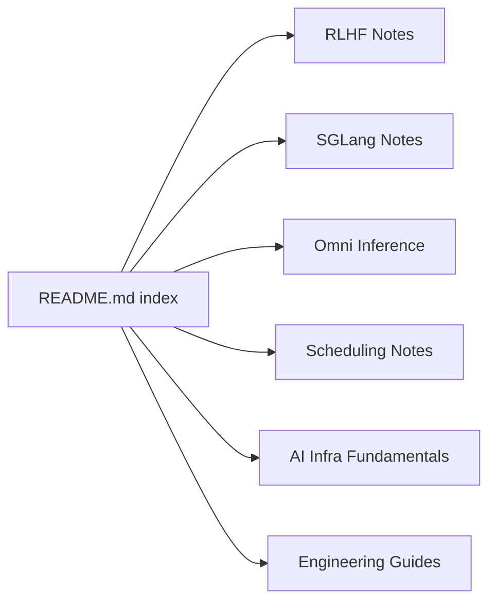

# zhaochenyang20/Awesome-ML-SYS-Tutorial

> Notes de cours en anglais et chinois sur l'infra RL et l'inférence LLM (SGLang, verl, slime).

## Le problème
Comprendre les systèmes derrière l'entraînement RLHF et le serving de LLM demande de lire beaucoup de code et d'articles dispersés.

## Ce que ça fait vraiment
Recueil de notes de l'auteur, classées : RL infra (slime, verl, OpenRLHF, AReaL), inférence (SGLang, ordonnancement, KV cache, décodage contraint, modèles omni/TTS), fondamentaux (CUDA Graph, NCCL, PyTorch distribué, quantification) et guide Docker. Certaines entrées sont marquées « Pending Review » ou « Not finished ».

## Comment c'est branché

## Essayer
Aucune commande documentée. Lire directement les notes depuis l'index du README.

## Coût et pièges
Gratuit. Une partie des articles est liée à Zhihu ou en chinois seul (« Available in Chinese version »). Le rendu GitHub de certains billets est jugé mauvais par l'auteur.

## Ce que ce n'est pas
Pas un tutoriel structuré ni un code exécutable : ce sont des notes d'apprentissage personnelles, d'inégale finition.

## Alternatives
Aucune alternative nommée dans le README.

## Pour toi
À adopter en lecture : gratuit et directement utile à un profil MLOps qui doit comprendre comment SGLang, verl ou slime servent et entraînent des LLM, à condition d'accepter des notes inégales.

