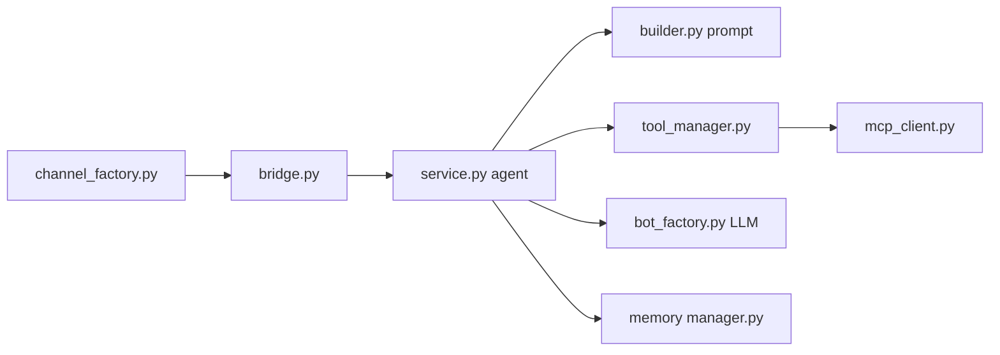

# zhayujie/CowAgent

> Assistant agent auto-hébergé, branché sur messageries et LLM, pour qui veut un bot personnel outillé.

## Le problème
Brancher un LLM sur WeChat, Feishu, Telegram ou Slack, avec outils, mémoire et skills, demande d'assembler soi-même beaucoup de pièces.

## Ce que ça fait vraiment
Des adaptateurs de canaux (`channel_factory.py`) normalisent les messages et les passent à un bridge (`bridge.py`), qui lance une boucle agent (`agent/chat/service.py`) : prompt, appels modèle, outils (fichiers, bash, navigateur, planificateur, MCP) et skills à manifeste. Mémoire à trois niveaux avec distillation nocturne, base de connaissances en Markdown, console web sur le port 9899. Fournisseurs multiples via `bot_factory.py`. Ancien nom : `chatgpt-on-wechat`.

## Comment c'est branché


## Essayer
```bash
bash <(curl -fsSL https://cdn.link-ai.tech/code/cow/run.sh)
curl -O https://cdn.link-ai.tech/code/cow/docker-compose.yml
docker compose up -d
cow start | stop | restart
```

## Coût et pièges
Clé d'API LLM à ta charge ; le README prévient que le mode agent consomme bien plus de tokens que le chat. L'agent a accès à l'OS local : à déployer seulement en environnement de confiance.

## Ce que ce n'est pas
Pas un framework d'agents à importer dans ton code : c'est un service complet. L'installateur passe par un CDN de LinkAI, qui vend aussi une offre hébergée.

## Alternatives
- AgentMesh — cadre multi-agents du même auteur, plus orienté bibliothèque.
- bot-on-anything — cadre plus léger pour brancher un LLM sur des messageries.

## Pour toi
À surveiller si tu veux un assistant perso sur messagerie ; trop de surface pour un besoin pro cadré.
