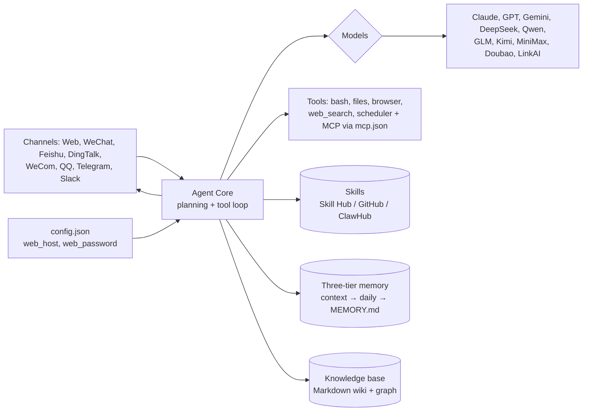

# zhayujie/chatgpt-on-wechat

> **A self-hosted LLM agent you wire into your chat apps, with memory and installable skills.**

## The problem

An agent that plans, reads files, runs commands and remembers usually lives in a terminal or
a browser tab. Reaching it from the messenger you actually spend the day in — WeChat, Feishu,
DingTalk, Telegram, Slack — means writing one connector per platform and stitching memory,
tools and a model provider together yourself.

## What it actually does

The repo ships what the README calls an *Agent Harness*: an agent core that decomposes a task
and loops over tools until the goal is reached, sitting between input channels and
interchangeable model providers.

- **Built-in tools**: files (`read` / `write` / `edit` / `ls`), terminal (`bash`),
  `web_fetch`, `web_search`, `scheduler`, `vision`, `browser`, file sending — plus MCP servers
  declared in a single `mcp.json` (stdio / SSE transports, hot reload).
- **Skills**: manifest-defined workflows, installed from the Skill Hub, GitHub or ClawHub, or
  written conversationally with `skill-creator`.
- **Three-tier memory**: conversation context → daily memory → `MEMORY.md`, with a nightly
  *Deep Dream* distillation pass, alongside a topic-organised knowledge base rendered as a
  Markdown wiki and a knowledge graph.
- **Multi-agent teams**: several agents, each with its own model, skills, memory and
  workspace, collaborating in one shared conversation.
- **Web console** on port `9899`: chat, model configuration, channel onboarding, skill
  installation. A bundled macOS / Windows desktop client is also offered.

The README lists twelve channels (web console, Telegram, Slack, Discord, WeChat, Feishu,
DingTalk, WeCom bot and app, QQ, WeChat Customer Service, Official Accounts) and routes chat,
vision, image generation, ASR/TTS and embeddings to separate vendors.

## How it is wired

No GitDiagram diagram exists for this repo; the graph below is reconstructed from the
README's *Architecture* section and names no file the README does not mention.



## Try it

Commands copied from the README, in its own order.

```bash
bash <(curl -fsSL https://cdn.link-ai.tech/code/cow/run.sh)     # Linux / macOS
# Windows (PowerShell): irm https://cdn.link-ai.tech/code/cow/run.ps1 | iex

curl -O https://cdn.link-ai.tech/code/cow/docker-compose.yml    # or Docker
docker compose up -d
# then http://localhost:9899

cow start | stop | restart        # service control
cow status | logs                  # status and logs
cow update                         # pull latest code and restart
cow skill install <name>           # install a skill
cow install-browser                # install browser automation
```

## Cost and traps

The code is MIT-licensed but ships no model: you need a key with a provider (Claude, GPT,
Gemini, DeepSeek, Qwen, GLM, Kimi, MiniMax, Doubao, ERNIE, MiMo, LinkAI, or a local model /
third-party proxy through *Custom* mode) and **the token bill is yours**. The README warns
that agent mode consumes substantially more tokens than regular chat. Two further warnings
are written into it: the agent has access to your local operating system, so it is only to be
deployed in trusted environments; and on a server the console needs `web_host` set to
`0.0.0.0` plus a `web_password` and port `9899` opened — an exposed console with no password
hands a shell to whoever finds it. Note too that the default install path downloads a script
from a third-party CDN (`cdn.link-ai.tech`), and the Skill Hub is a hosted service.

## What it is not

- **It is no longer "ChatGPT on WeChat".** The README opens as *CowAgent* and closes with a
  renaming notice: the repo is now `zhayujie/CowAgent`, the old URL redirects, and existing
  users may run `git remote set-url origin https://github.com/zhayujie/CowAgent.git`. Coming
  here for a plain ChatGPT-to-WeChat bridge means misreading both the object and its scope.
- **It is not a managed service.** You host, secure and upgrade it; the hosted variant is a
  separate commercial product (LinkAI), with a sales contact.
- **Attaching a personal messaging account is not a neutral act.** The README lists WeChat as
  a channel but says nothing about platform terms of use or any risk to the account: that
  point is **undocumented** and stays on you. The only caution given is generic — comply with
  applicable law, maintainers accept no liability.
- It is not a model, and not a library to import: it is an application to deploy.

## Alternatives

Only projects named in the README itself, since the catalogue supplied no neighbours here.

| | When to prefer it |
|---|---|
| **zhayujie/bot-on-anything** | Described as a lighter LLM application framework with Slack, Telegram, Discord and Gmail integrations — if you only want to relay a model into a messenger, without agent loop, memory or skills. |
| **MinimalFuture/AgentMesh** | Presented as a multi-agent framework: if the subject is agents collaborating rather than plugging into IM channels. |
| **LinkAI (hosted CowAgent)** | If you want neither a server nor upgrades: the README offers an online instance, but it is a third-party commercial offer. |

## For you

For a data / AI profile the draw is not the assistant but **the assembly**: three-tier memory
with periodic distillation, manifest-based installable skills, MCP wired through `mcp.json`,
and a channel layer abstracting twelve messengers. Worth reading as an architecture reference,
and possibly for the channel layer if you ever need to expose an agent in Slack or Feishu —
the rest overlaps what Claude Code already does for you. Its dominant channels (WeChat,
Feishu, DingTalk, WeCom, QQ) remain centred on the Chinese market, which limits direct use.
Watch it; do not adopt it as-is.
