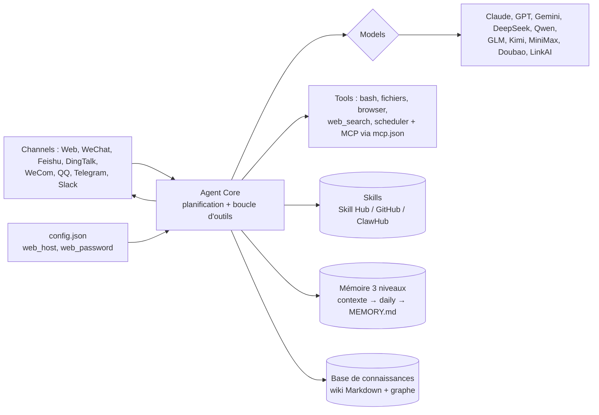

# zhayujie/chatgpt-on-wechat

> **Un agent LLM auto-hébergé qu'on branche sur ses messageries, avec mémoire et skills.**

## Le problème

Un agent capable de planifier, lire des fichiers, lancer des commandes et se souvenir vit
en général dans un terminal ou un onglet de navigateur. Le joindre depuis la messagerie où
l'on passe sa journée — WeChat, Feishu, DingTalk, Telegram, Slack — demande d'écrire un
connecteur par plateforme, et de recoller soi-même mémoire, outils et fournisseur de modèle.

## Ce que ça fait vraiment

Le dépôt fournit ce que le README appelle un *Agent Harness* : un cœur d'agent qui décompose
une tâche et boucle sur des outils jusqu'au but, posé entre des canaux d'entrée et des
fournisseurs de modèles interchangeables.

- **Outils intégrés** : fichiers (`read` / `write` / `edit` / `ls`), terminal (`bash`),
  `web_fetch`, `web_search`, `scheduler`, `vision`, `browser`, envoi de fichiers — plus les
  serveurs MCP déclarés dans un `mcp.json` (stdio / SSE, rechargement à chaud).
- **Skills** : des workflows décrits par un manifeste, installables depuis le Skill Hub,
  GitHub ou ClawHub, ou rédigés par conversation avec `skill-creator`.
- **Mémoire à trois niveaux** : contexte de conversation → mémoire quotidienne → `MEMORY.md`,
  avec une passe nocturne *Deep Dream* qui condense, et une base de connaissances par sujet
  rendue en wiki Markdown et en graphe.
- **Équipes multi-agents** : plusieurs agents avec leur propre modèle, skills, mémoire et
  espace de travail, dans une conversation partagée.
- **Console web** sur le port `9899` : chat, choix des modèles, branchement des canaux,
  installation des skills. Un client de bureau macOS / Windows est aussi proposé.

Le README annonce douze canaux (console web, Telegram, Slack, Discord, WeChat, Feishu,
DingTalk, WeCom, QQ, service client WeChat, comptes officiels) et route séparément chat,
vision, génération d'images, ASR/TTS et embeddings vers des fournisseurs différents.

## Comment c'est branché

Aucun diagramme GitDiagram n'existe pour ce dépôt ; le schéma ci-dessous est reconstitué
depuis la section *Architecture* du README, sans nommer de fichier qu'il ne cite pas.



## Essayer

Commandes recopiées du README, dans son ordre.

```bash
bash <(curl -fsSL https://cdn.link-ai.tech/code/cow/run.sh)     # Linux / macOS
# Windows (PowerShell) : irm https://cdn.link-ai.tech/code/cow/run.ps1 | iex

curl -O https://cdn.link-ai.tech/code/cow/docker-compose.yml    # ou Docker
docker compose up -d
# puis http://localhost:9899

cow start | stop | restart        # service control
cow status | logs                  # status and logs
cow update                         # pull latest code and restart
cow skill install <name>           # install a skill
cow install-browser                # install browser automation
```

## Coût et pièges

Le code est sous MIT, mais il n'embarque aucun modèle : il faut une clé chez un fournisseur
(Claude, GPT, Gemini, DeepSeek, Qwen, GLM, Kimi, MiniMax, Doubao, ERNIE, MiMo, LinkAI, ou un
modèle local / proxy via le mode *Custom*) et **la facture de jetons est pour toi**. Le README
prévient que le mode agent consomme nettement plus de jetons qu'un chat classique. Deux
autres points d'attention y sont écrits noir sur blanc : l'agent a accès au système
d'exploitation local, donc à ne déployer qu'en environnement de confiance ; et sur serveur, la
console doit passer `web_host` à `0.0.0.0` avec un `web_password` et le port `9899` ouvert —
une console exposée sans mot de passe donne un shell à qui la trouve. Enfin, le chemin
d'installation par défaut télécharge un script depuis un CDN tiers (`cdn.link-ai.tech`), et le
Skill Hub est un service hébergé.

## Ce que ce n'est pas

- **Ce n'est plus « ChatGPT on WeChat ».** Le README ouvre sur *CowAgent* et se termine par un
  avis de renommage : le dépôt s'appelle désormais `zhayujie/CowAgent`, l'ancienne URL
  redirige, et les utilisateurs existants peuvent faire
  `git remote set-url origin https://github.com/zhayujie/CowAgent.git`. Chercher ici un
  simple pont ChatGPT ↔ WeChat, c'est se tromper d'objet et de périmètre.
- **Ce n'est pas un service géré.** Tout est à héberger et à surveiller soi-même ; la version
  hébergée est un produit commercial séparé (LinkAI), avec contact commercial.
- **Brancher un compte de messagerie personnel n'est pas anodin.** Le README liste WeChat
  comme canal mais ne dit rien des conditions d'utilisation ni d'un éventuel risque pour le
  compte : ce point est **non documenté**, et il reste à ta charge. La seule mise en garde
  fournie est générale — respect des lois applicables, aucune responsabilité des mainteneurs.
- Ce n'est pas un modèle, ni une bibliothèque à importer : c'est une application à déployer.

## Alternatives

Uniquement des projets nommés dans le README lui-même, faute de voisins fournis par le
catalogue pour ce dépôt.

| | Quand le préférer |
|---|---|
| **zhayujie/bot-on-anything** | Décrit comme un cadre d'application LLM plus léger, avec des intégrations Slack, Telegram, Discord, Gmail — si tu veux juste relayer un modèle dans une messagerie, sans agent, mémoire ni skills. |
| **MinimalFuture/AgentMesh** | Cadre multi-agents présenté comme tel : si le sujet est la collaboration entre agents et pas le branchement sur des canaux IM. |
| **LinkAI (CowAgent hébergé)** | Si tu ne veux ni serveur ni mise à jour : le README propose une instance en ligne, mais c'est une offre commerciale tierce. |

## Pour toi

L'intérêt pour un profil data / IA n'est pas l'assistant, c'est **l'assemblage** : mémoire à
trois niveaux avec condensation périodique, skills à manifeste installables, MCP par
`mcp.json`, et une couche de canaux qui abstrait douze messageries. À regarder comme
référence d'architecture, et éventuellement pour la couche canaux si tu dois un jour exposer
un agent dans Slack ou Feishu — le reste recoupe ce que Claude Code fait déjà chez toi.
Les canaux dominants (WeChat, Feishu, DingTalk, WeCom, QQ) restent centrés sur le marché
chinois, ce qui limite l'usage direct. À surveiller, pas à adopter tel quel.
