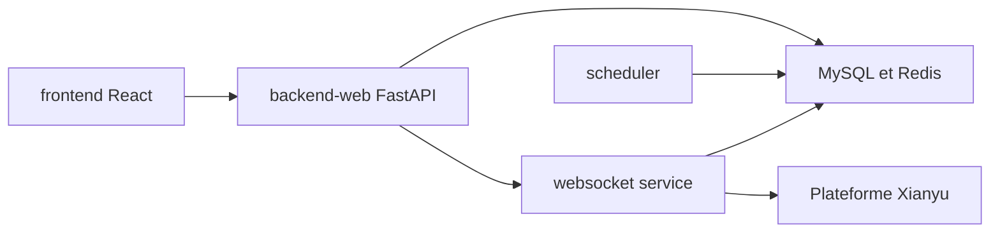

# zhinianboke/xianyu-auto-reply

> Plateforme d'automatisation multi-comptes pour la place de marché chinoise Xianyu : réponses, livraison, publication.

## Le problème
Les vendeurs Xianyu répondent, livrent et publient à la main ; on veut automatiser ces flux sur plusieurs comptes.

## Ce que ça fait vraiment
Services FastAPI, WebSocket et planificateur : connexion aux comptes (Cookie, QR), réponses automatiques par mots-clés ou IA, livraison automatique de cartes, publication d'annonces, suivi de commandes, surveillance de fiches, API externes par clé secrète, plus un sous-système d'affiliation et un client mobile Expo. README en chinois.

## Comment c'est branché


## Essayer
```bash
git clone https://github.com/zhinianboke/xianyu-auto-reply.git
cd xianyu-auto-reply
bash deploy.sh
```

## Coût et pièges
Docker, 4 Go de RAM minimum, MySQL, Redis, Chromium (Playwright). Compte admin par défaut `admin`/`admin123` à changer. Le README propose aussi un script distant exécuté via `curl | bash`. Risque de sanction du compte par la plateforme, admis par l'auteur.

## Ce que ce n'est pas
Pas libre d'usage commercial malgré l'AGPL-3.0 : le README interdit tout usage commercial. Les comportements dépendent de l'API non officielle de la plateforme.

## Alternatives
XianYuApis et XianyuAutoAgent, cités comme sources d'inspiration.

## Pour toi
À ignorer : automatisation d'une place de marché chinoise, avec clause non commerciale et risque de bannissement, sans lien avec un travail data/IA/MLOps.

