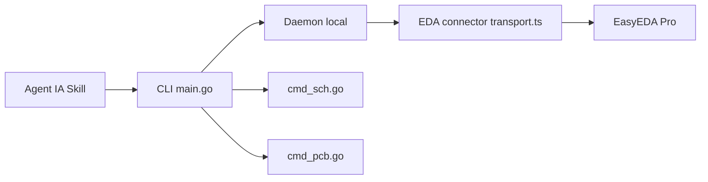

# zhoushoujianwork/easyeda-agent

> Couche d'automatisation IA pour EasyEDA Pro : schémas, PCB, bibliothèques et vérifications pilotés par un agent.

## Le problème
Concevoir schéma et PCB à la main est long, et laisser une IA écrire du JS libre dans l'éditeur est peu auditable.

## Ce que ça fait vraiment
Un CLI `easyeda` avec daemon local parle à un connecteur (.eext) dans EasyEDA Pro via l'API officielle `eda.*`, avec actions typées. Crée des bibliothèques depuis un PDF, place et route les composants, ajuste la sérigraphie, remplace des composants par numéro LCSC, lance DRC/DFM et exporte. Vérifie avant et après écriture. Le README est en chinois.

## Comment c'est branché


## Essayer
```bash
curl -fsSL https://raw.githubusercontent.com/zhoushoujianwork/easyeda-agent/main/install.sh | bash
easyeda daemon start
easyeda health
```

## Coût et pièges
Nécessite EasyEDA Pro V4 avec « allow external interaction ». Pas d'undo programmatique ; impédance contrôlée non vérifiable ; routage dense demande Freerouting.

## Ce que ce n'est pas
Pas une preuve de production : le README précise que certains cas ne sont pas validés. Licence non identifiée par GitHub (MIT annoncée).

## Alternatives
- Freerouting : pour le routage dense complet.

## Pour toi
À ignorer pour un profil data/IA/MLOps : outil de conception électronique hors de ton périmètre.

