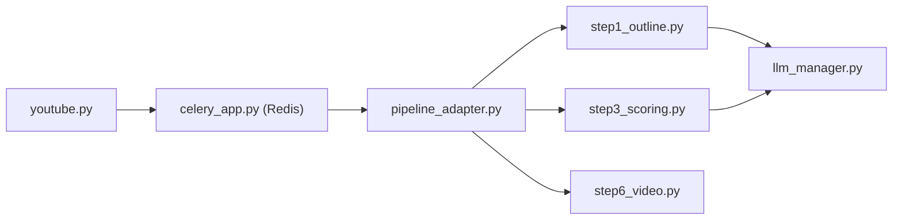

# zhouxiaoka/autoclip

> Application qui découpe une longue vidéo parlée en extraits courts, choisis par un LLM.

## Le problème
Repérer à la main les moments forts d'un podcast, d'un cours ou d'une interview, les couper, les titrer puis les publier prend des heures.

## Ce que ça fait vraiment
Import d'une URL YouTube/Bilibili ou d'un fichier local ; sous-titres SRT fournis ou transcrits en local par Whisper.
Pipeline en six étapes : plan, timeline, notation des extraits, titres, regroupement en collections, export vidéo (FFmpeg) ; le LLM intervient à chaque étape sauf l'export.
Tâches asynchrones via Celery et Redis ; interface web React, appli de bureau, CLI et serveur MCP.
Publication vers TikTok, YouTube, etc. via un compte Upload-Post, vers Bilibili par cookie.

## Comment c'est branché


## Essayer
```bash
git clone https://github.com/zhouxiaoka/autoclip.git
cd autoclip
cp env.example .env
mkdir -p data logs uploads
docker compose up -d --build
# ou en CLI, après pip install -r requirements.txt && pip install -e . :
autoclip doctor --provider ollama
autoclip run talk.mp4 --provider ollama --json
```

## Coût et pièges
Modèle cloud à ta charge, ou Ollama / LM Studio en local avec le matériel qui va avec. Publication hors Chine : compte Upload-Post et ses quotas. Statistiques et rapports d'erreur selon la version et les réglages.

## Ce que ce n'est pas
Pas un monteur visuel : l'analyse repose sur les sous-titres, les vidéos d'action ou musicales donnent peu.
Pas garanti : il arrive qu'aucun extrait ne sorte (baisser le seuil de 0,7 à 0,5).
Le README met en avant un revendeur d'API sponsor, lien d'affiliation compris.

## Alternatives
Aucune alternative nommée dans le README.

## Pour toi
Hors cœur data/MLOps : à ignorer, sauf si tu produis du contenu vidéo.
