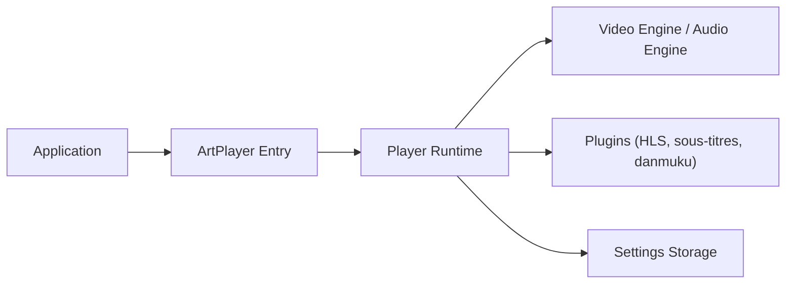

# zhw2590582/ArtPlayer

> Lecteur vidéo HTML5 personnalisable, avec plugins, pour développeurs web.

## Le problème
Le lecteur natif du navigateur ne couvre ni sous-titres avancés, ni flux HLS/DASH, ni commentaires flottants.

## Ce que ça fait vraiment
`new Artplayer({ container, url })` crée le lecteur. Formats `.vtt`, `.ass`, `.srt` pris en charge ; hls.js, dash.js, flv.js, mpegts.js, webtorrent en bibliothèques externes ; plugins (danmuku, chromecast, VAST, chapitres, ASR, etc.). Un proxy Mediabunny/Canvas est disponible.

## Comment c'est branché


## Essayer
```bash
npm install artplayer
```
```js
let art = new Artplayer({
  container: '.artplayer-app',
  url: 'path/to/video.mp4',
})
```

## Coût et pièges
Gratuit ; dons Patreon/PayPal. Le plugin de publicité est marqué WIP.

## Ce que ce n'est pas
Pas un serveur ni un service de streaming : uniquement le lecteur côté client.

## Alternatives
- hls.js, dash.js, flv.js : moteurs de lecture intégrables, cités dans le README.

## Pour toi
À ignorer : composant front-end sans rapport avec les métiers data/IA/MLOps, sauf besoin ponctuel de lecteur vidéo web.

