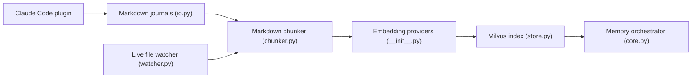

# zilliztech/memsearch

> Mémoire sémantique partagée entre agents de code, avec notes Markdown et recherche hybride Milvus.

## Le problème
Les agents de code oublient d'une session à l'autre, et chaque plateforme garde sa mémoire dans son coin.

## Ce que ça fait vraiment
Des plugins (Claude Code, Codex, DeepSeek Harness, OpenClaw, OpenCode) capturent chaque tour, le résument et l'ajoutent à des journaux Markdown quotidiens. Le CLI indexe ces fichiers dans Milvus (recherche dense + BM25 + RRF, hash SHA-256 pour éviter de réindexer), avec rappel en trois couches (recherche, expansion, transcript). Le Markdown reste la source de vérité ; Milvus est un index reconstructible. Options : `PROJECT.md`/`USER.md` et skills tirés de l'historique, désactivés par défaut.

## Comment c'est branché


## Essayer
```bash
/plugin marketplace add zilliztech/memsearch
/plugin install memsearch
uv tool install "memsearch[onnx]"
memsearch search "Redis caching"
```

## Coût et pièges
Par défaut : embeddings ONNX bge-m3 locaux (modèle d'environ 558 Mo téléchargé) et Milvus Lite, sans clé. Le résumé de capture appelle un LLM ; Zilliz Cloud et OpenAI sont optionnels.

## Ce que ce n'est pas
Pas un simple wrapper : il demande Milvus et un modèle d'embedding. 254 issues ouvertes.

## Alternatives
Aucune alternative nommée dans le README (OpenClaw cité comme inspiration).

## Pour toi
À surveiller : approche saine (Markdown source de vérité, tout local possible), pertinente pour la mémoire d'agents côté MLOps.

