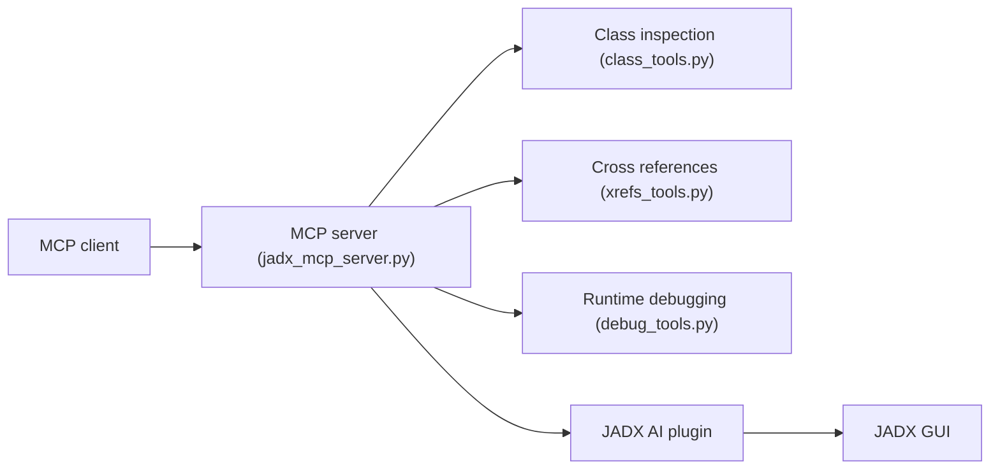

# zinja-coder/jadx-mcp-server

> Serveur MCP Python qui relie un LLM au décompilateur JADX pour analyser des APK Android.

## Le problème
Analyser une application Android décompilée à la main est lent : classes, manifeste, ressources, références croisées.

## Ce que ça fait vraiment
Reçoit les appels d'outils MCP d'un client LLM et les transmet en HTTP à un plugin JADX-AI-MCP dans jadx-gui, qui renvoie le contexte. Outils : lecture de classes et méthodes, smali, manifeste, ressources, renommage de variables, références croisées paginées, débogage (piles, threads, variables).

## Comment c'est branché


## Essayer
```bash
uv run jadx_mcp_server.py --http
```

## Coût et pièges
Gratuit ; il faut aussi le plugin jadx-ai-mcp à installer à part. Avec --host 0.0.0.0, HTTP sans authentification ni TLS : tout le réseau peut appeler les outils.

## Ce que ce n'est pas
Pas un scanner de vulnérabilités automatique : le LLM interprète. Usage strictement légal, sur des applications que tu as le droit d'analyser.

## Alternatives
Aucune alternative nommée ; la suite de l'auteur cite APKTool-MCP-Server.

## Pour toi
À ignorer pour un travail data/IA : outil de rétro-ingénierie mobile, utile seulement si c'est ton métier.

