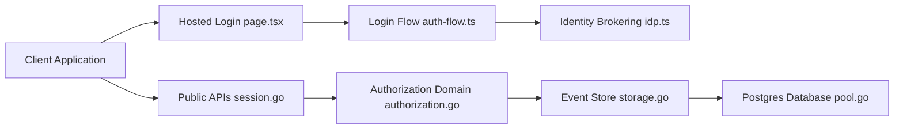

# zitadel/zitadel

> Plateforme d'identité et d'accès auto-hébergeable (SSO, MFA, OIDC, SAML), pensée multi-tenant pour produits B2B.

## Le problème
Brancher SSO, MFA, passkeys et organisations clientes isolées dans un produit prend des mois, et les offres SaaS enferment.

## Ce que ça fait vraiment
Serveur IAM API-first (gRPC, connectRPC, REST) avec hiérarchie Instances → Organisations → Projets.
Chaque mutation est écrite comme un événement immuable : piste d'audit complète, exportable par webhooks.
Login hébergé (Login V2), fédération d'IdP externes, SCIM 2.0, actions/webhooks, console d'admin.
Stockage PostgreSQL ≥ 14 ; même code en cloud et en auto-hébergé.

## Comment c'est branché


## Essayer
```bash
curl -LO https://raw.githubusercontent.com/zitadel/zitadel/main/deploy/compose/docker-compose.yml \
  && curl -LO https://raw.githubusercontent.com/zitadel/zitadel/main/deploy/compose/.env.example \
  && cp .env.example .env \
  && docker compose up -d --wait
```

## Coût et pièges
Auto-hébergé gratuit (Docker + PostgreSQL) ; ZITADEL Cloud en paiement à l'usage. Support pro payant.

## Ce que ce n'est pas
Pas une simple lib d'auth à embarquer : c'est un service à opérer. AGPL : modifier et exposer le code impose de le publier.

## Alternatives
- Keycloak : open source et auto-hébergeable, plus répandu, mais realms moins scalables selon le README.
- FusionAuth : tenants natifs, mais non open source.
- Auth0/Okta : SaaS sans auto-hébergement.

## Pour toi
À surveiller : utile si tu dois exposer une plateforme ML multi-clients avec SSO, hors sujet pour un pipeline data interne.
