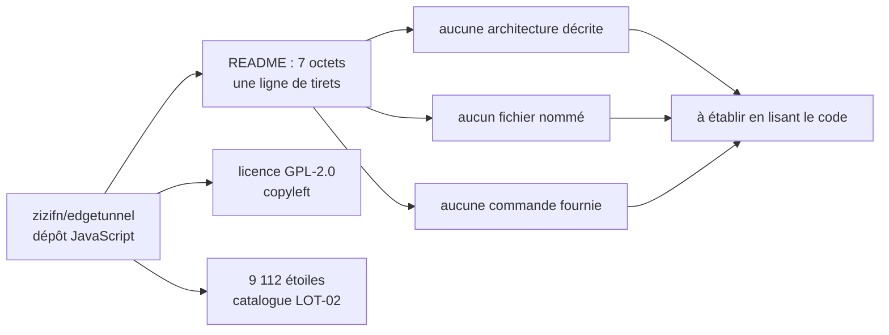

# zizifn/edgetunnel

> **A GPL-2.0 JavaScript repository with no usable README: nothing is documented, everything remains to be verified.**

## The problem

Impossible to establish. The repository's README is 7 bytes long and contains a single line of
dashes (`------`). No sentence, no heading, no link. Nowhere does the repository state which
problem it solves, or for whom. That is the main finding of this note: with 9,112 stars, this
repository offers no written entry point at all.

## What it actually does

Not documented. The only factual material available comes from the catalogue row: main language
**JavaScript**, licence **GPL-2.0**, **9,112 stars**. Nothing in the material read allows one to
say what the code runs, what it takes as input, or what it produces. The repository name is the
only hint, and a name is not documentation — it is not used here to infer behaviour. Any
description of the mechanics would require reading the code, which is not part of the material
provided.

## How it is wired

No code-derived diagram exists for this repository, and the README names no file and no
component. This chart therefore does not describe the project's architecture: it only maps the
state of the available material and what is missing to reconstruct it.

## Trying it

No documented command. The README contains no code block, no installation instruction, no usage
example, and no link to external documentation. There is nothing to copy here, and nothing will
be reconstructed: an invented command would be worse than no command. The only honest starting
point is to clone the repository and read its tree looking for a `package.json` or an entry
file.

## Cost and pitfalls

- **The main pitfall is the absence of documentation.** With no README, the dependencies, the
  runtime prerequisites, any third-party services called, and any keys or accounts required are
  all unknown. The adoption cost is not zero: it is the time spent reading the code, which
  cannot be estimated from here.
- **GPL-2.0 licence**: copyleft. Redistributing a derivative requires publishing the sources
  under the same licence. That rules it out for embedding in a proprietary product, and it is
  the only certain legal element in this note.
- **Governance**: the repository sits on a personal account (`zizifn`), not an organisation. The
  README mentions no team, no governance, and no contribution policy.
- **The `Node` prerequisite** is inferred from the JavaScript language recorded by the
  catalogue, not from the README, which requires nothing because it says nothing. To be
  confirmed against the repository.

## What it is not

- **It is not a project that can be judged on the evidence at hand.** The 9,112 stars show that
  it interests people; they say nothing about what it does, whether it is maintained, or whether
  it fits a given use. Mistaking popularity for documented quality is precisely the error this
  note exists to prevent.
- **It is not self-explanatory**: no quickstart, no screenshots, no FAQ. Anyone installing it
  does so without a written safety net.
- **It is not freely reusable**: GPL-2.0 constrains redistribution, which excludes quiet
  integration into closed code.
- **This note is not a description of the project**, only the observation that the material
  needed to write one is missing.

## Alternatives

No comparable alternative in the catalogue. The neighbours suggested by the lexical scoring —
`localstack/localstack`, `harness/harness`, `abiosoft/colima`, `helm/helm` — are infrastructure
and development tools (cloud service emulation, continuous delivery, container machines on
macOS, Kubernetes package management) brought close by mere vocabulary overlap. Since the README
does not say what `edgetunnel` does, no comparison can be drawn without inventing the very point
of comparison.

## For you

Watch it, do not adopt it as it stands. For a data / AI / MLOps profile, a repository without a
single line of documentation is not installed: it is read first, and that reading time is the
real cost. Should the subject prove relevant after inspecting the code, GPL-2.0 will remain the
blocker for any use embedded in a client deliverable. Worth revisiting if a README is ever
written — the fingerprint recorded here will trigger a rewrite of this note.
