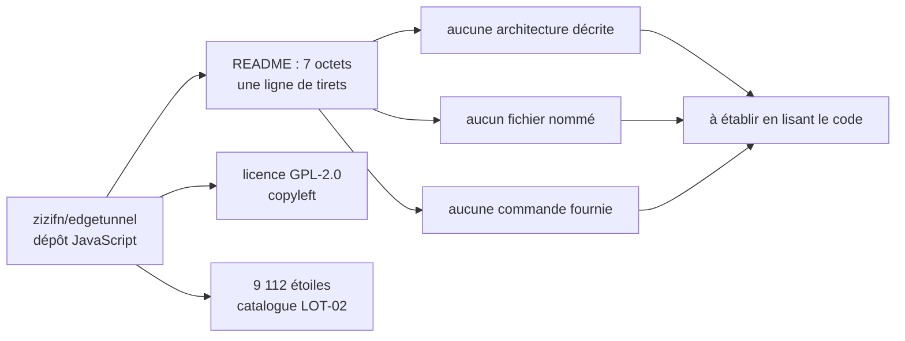

# zizifn/edgetunnel

> **Dépôt JavaScript sous GPL-2.0 sans README exploitable : rien n'y est documenté, tout reste à vérifier.**

## Le problème

Impossible à établir : le README du dépôt fait 7 octets et ne contient qu'une ligne de tirets
(`------`). Aucune phrase, aucun titre, aucun lien. Le dépôt ne dit nulle part quel problème il
résout ni pour qui. C'est en soi l'information principale de cette fiche : à 9 112 étoiles, ce
dépôt ne fournit aucune porte d'entrée écrite.

## Ce que ça fait vraiment

Non documenté. Le seul factuel disponible vient de la ligne du catalogue : langage principal
**JavaScript**, licence **GPL-2.0**, **9 112 étoiles**. Rien dans la matière lue ne permet de
dire ce que le code exécute, ce qu'il prend en entrée, ni ce qu'il produit. Le nom du dépôt est
le seul indice, et un nom n'est pas une documentation — on ne s'en sert pas ici pour déduire un
comportement. Toute description du fonctionnement demanderait de lire le code, qui n'est pas
dans la matière fournie.

## Comment c'est branché

Aucun diagramme tiré du code n'existe pour ce dépôt, et le README ne nomme aucun fichier ni
aucun composant. Ce schéma ne décrit donc pas l'architecture du projet : il ne fait que
cartographier l'état de la matière disponible et ce qui manque pour la reconstituer.

## Essayer

Aucune commande documentée. Le README ne contient ni bloc de code, ni instruction
d'installation, ni exemple d'usage, ni lien vers une documentation externe. Rien n'est copiable
ici, et rien ne sera reconstruit : une commande inventée serait pire que pas de commande. Le
seul point de départ honnête est de cloner le dépôt et de lire son arborescence pour y chercher
un `package.json` ou un fichier d'entrée.

## Coût et pièges

- **Le piège principal est l'absence de documentation.** Sans README, on ne connaît ni les
  dépendances, ni les prérequis d'exécution, ni les éventuels services tiers appelés, ni les
  clés ou comptes nécessaires. Le coût d'adoption n'est pas nul : c'est le temps de lecture du
  code, non chiffrable depuis ici.
- **Licence GPL-2.0** : copyleft. Toute redistribution d'un dérivé impose de publier les
  sources sous la même licence. C'est disqualifiant pour un usage embarqué dans un produit
  propriétaire, et c'est le seul élément juridique certain de cette fiche.
- **Gouvernance** : le dépôt est hébergé sur un compte personnel (`zizifn`), pas sur une
  organisation. Le README ne mentionne ni équipe, ni gouvernance, ni politique de contribution.
- **Prérequis `Node`** : déduit du langage JavaScript relevé par le catalogue, pas du README,
  qui n'exige rien puisqu'il ne dit rien. À confirmer sur le dépôt.

## Ce que ce n'est pas

- **Ce n'est pas un projet évaluable sur pièces.** Les 9 112 étoiles disent qu'il intéresse du
  monde ; elles ne disent ni ce qu'il fait, ni s'il est maintenu, ni s'il convient à un usage
  donné. Confondre popularité et qualité documentaire est exactement l'erreur que cette fiche
  doit éviter.
- **Ce n'est pas un projet auto-explicatif** : il n'y a pas de démarrage rapide, pas de
  captures, pas de FAQ. Quiconque l'installe le fait sans filet écrit.
- **Ce n'est pas réutilisable librement** : la GPL-2.0 encadre la redistribution, ce qui exclut
  l'intégration silencieuse dans un code fermé.
- **Cette fiche n'est pas une description du projet**, seulement le constat que la matière
  manque pour en écrire une.

## Alternatives

Aucune alternative comparable dans le catalogue. Les voisins proposés par le lexique —
`localstack/localstack`, `harness/harness`, `abiosoft/colima`, `helm/helm` — sont des outils
d'infrastructure et de développement (émulation de services cloud, chaîne de livraison
continue, machines de conteneurs sur macOS, gestion de paquets Kubernetes) rapprochés par
simple proximité de vocabulaire. Comme le README ne dit pas ce que fait `edgetunnel`, aucune
comparaison ne peut être établie sans inventer le point de comparaison.

## Pour toi

À surveiller, pas à adopter en l'état. Pour un profil data / IA / MLOps, un dépôt sans une
ligne de documentation ne s'installe pas : il se lit d'abord, et ce temps de lecture est le
coût réel. Si le sujet s'avère pertinent après inspection du code, la GPL-2.0 restera le point
bloquant pour tout usage intégré à un livrable client. À reprendre si le README est un jour
écrit — l'empreinte enregistrée ici déclenchera la réécriture de la fiche.
