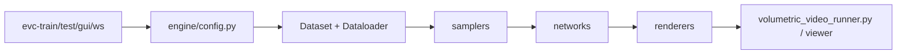

# zju3dv/EasyVolcap

> Bibliothèque PyTorch pour la recherche en vidéo volumétrique neuronale : capture, reconstruction, rendu.

## Le problème
Chaque papier de rendu neuronal dynamique (NeRF, 3DGS temporel) réimplémente ses données, sa config et son viewer.

## Ce que ça fait vraiment
Un cadre modulaire où un lot de données passe par un `sampler`, un `network` et un `renderer` choisis par fichiers YAML. Il fournit Instant-NGP+T, 3DGS+T et ENeRFi, des commandes `evc-train`, `evc-test`, `evc-gui`, `evc-ws`, un viewer OpenGL et un rendu par WebSocket. Les données sont simplement des images plus `intri.yml` et `extri.yml`.

## Comment c'est branché


## Essayer
```bash
pip install -v -e .
evc-test -c configs/exps/enerfi/enerfi_${expname}.yaml,configs/specs/spiral.yaml,configs/specs/ibr.yaml runner_cfg.visualizer_cfg.save_tag=${expname} exp_name=enerfi_dtu
evc-train -c configs/exps/l3mhet/l3mhet_${expname}.yaml
```

## Coût et pièges
Gratuit, mais un GPU CUDA est nécessaire ; Instant-NGP+T exige `tiny-cuda-nn`, 3DGS+T exige `diff_gaussian_rasterization`. Sous Windows, on peut obtenir un PyTorch CPU sans le vouloir. Le jeu d'exemple et les modèles sont sur Google Drive.

## Ce que ce n'est pas
Pas un produit : la documentation est marquée en chantier et le README est coupé en cours de bloc de code. Les auteurs conseillent de forker plutôt que d'importer la bibliothèque.

## Alternatives
Nerfstudio, cité parmi les travaux dont le projet s'inspire.

## Pour toi
À ignorer sauf recherche en vision 3D : niche très spécialisée, licence présente mais non identifiée, GPU obligatoire.
