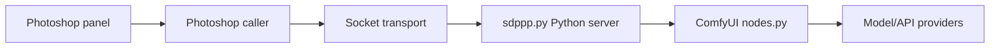

# zombieyang/sd-ppp

> Plugin Photoshop non officiel qui relie l'application à ComfyUI et à des API de modèles d'images.

## Le problème
Utiliser des modèles génératifs depuis Photoshop impose des allers-retours manuels d'exports et d'imports.

## Ce que ça fait vraiment
README très court. La version 2.0 bêta (Photoshop 2025, PS26+) prend en charge les modèles et applis de replicate.com et runninghub.ai, sans nœuds personnalisés ComfyUI. Interface refondue pour envoyer et recevoir des images, raccourcis clavier, sélection de zones, calques ou documents. D'après le code : panneau Photoshop, extension ComfyUI et serveur Python communiquant par sockets.

## Comment c'est branché

## Essayer
Aucune commande documentée dans le README ; téléchargement de la 2.0 Beta et site officiel renvoyés par des liens.

## Coût et pièges
Photoshop 2025 requis pour la 2.0. Les API tierces (Replicate, RunningHub, etc.) sont facturées à part.

## Ce que ce n'est pas
Pas un produit Adobe. Les commandes et usages détaillés sont sur le site, non dans le dépôt.

## Alternatives
Aucune alternative nommée dans le README.

## Pour toi
À surveiller : seulement si tes flux passent par Photoshop et ComfyUI ; peu d'intérêt pour de la data ou du MLOps.

