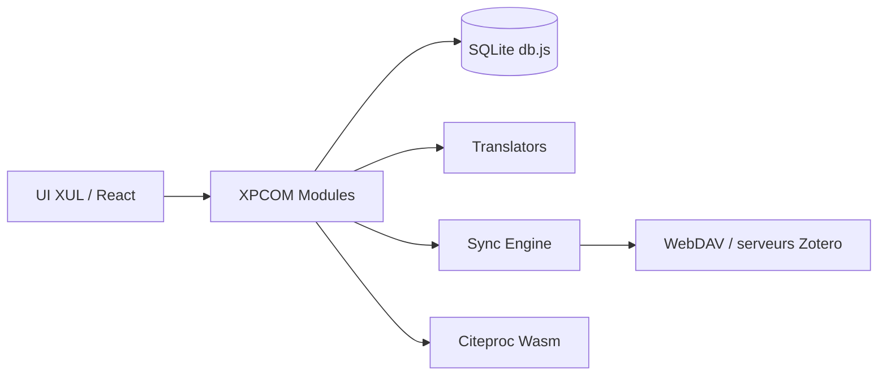

# zotero/zotero

> Gestionnaire de références bibliographiques pour collecter, organiser, citer et partager ses sources de recherche.

## Le problème
Le README est tronqué : le problème n'est pas développé. D'après la phrase de présentation, gérer sources et citations de recherche.

## Ce que ça fait vraiment
Le README ne détaille rien. D'après l'architecture tirée du code : application de bureau multiplateforme sur base Mozilla (XUL, XPCOM, React), stockage SQLite, moteur de synchronisation (serveur Zotero, WebDAV), traducteurs pour extraire les références du web, formatage des bibliographies par un moteur citeproc en Wasm, et paquets pour macOS, Windows et Linux.

## Comment c'est branché

## Essayer
Aucune commande dans le README : renvoi vers la documentation de Zotero.

## Coût et pièges
Licence présente mais non identifiée par GitHub : à vérifier. 1 599 issues ouvertes ; le README renvoie aux forums plutôt qu'aux issues.

## Ce que ce n'est pas
Ce dépôt n'est pas un guide d'utilisation : c'est le code source de l'application. Les conditions de la synchronisation (compte, quotas) ne sont pas décrites.

## Alternatives
Aucune alternative nommée dans le README.

## Pour toi
À surveiller : utile pour gérer une bibliographie de veille et de recherche en IA ; matière trop mince pour aller plus loin sur ce dépôt.

