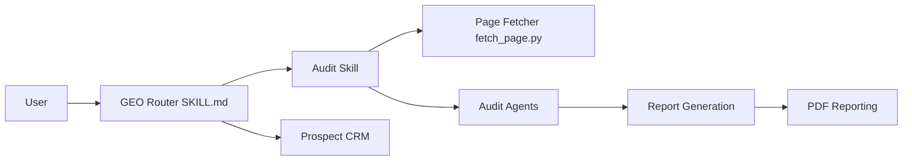

# zubair-trabzada/geo-seo-claude

> Skill Claude Code d'audit SEO et de visibilité dans les moteurs de recherche IA.

## Le problème
Les sites optimisés pour Google ne sont pas forcément cités par ChatGPT, Perplexity ou les AI Overviews.

## Ce que ça fait vraiment
Installe un skill `geo` et 13 sous-skills dans `~/.claude/skills`, avec 5 sous-agents parallèles.
`/geo audit` récupère le site, lance les agents (visibilité IA, plateformes, technique, contenu, schema) et calcule un score 0-100 pondéré.
Scripts Python : scoring de « citabilité », analyse robots.txt pour crawlers IA, génération llms.txt, scan de marque, rapport PDF (ReportLab).
Module CRM de prospects et propositions commerciales stocké dans `~/.geo-prospects/`.

## Comment c'est branché


## Essayer
```bash
git clone https://github.com/zubair-trabzada/geo-seo-claude.git
cd geo-seo-claude
./install.sh
```

## Coût et pièges
Nécessite Claude Code (abonnement ou clé à ta charge). L'installeur `curl | bash` modifie ta config Claude. Les chiffres « marché GEO » du README ne sont pas sourcés.

## Ce que ce n'est pas
Pas une mesure réelle de citation par les IA : heuristiques de scoring. Le README sert aussi d'entonnoir vers une communauté payante.

## Alternatives
Aucune nommée dans le README.

## Pour toi
À ignorer : outil marketing/agence, hors du périmètre data/MLOps ; seul l'agencement skill + sous-agents peut servir d'exemple d'architecture.
