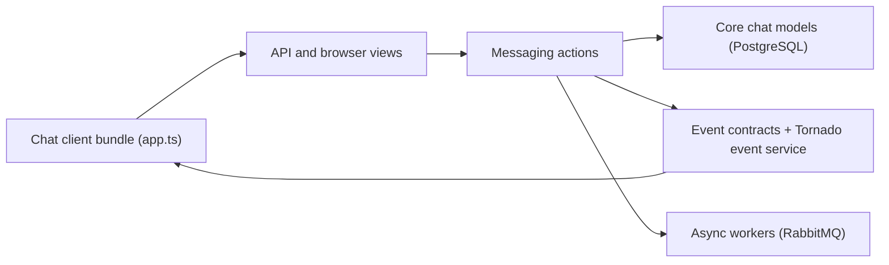

# zulip/zulip

> Messagerie d'équipe open source organisée en fils par sujet, auto-hébergeable ou en offre cloud.

## Le problème
Les discussions d'équipe se noient dans les flux continus ; il faut concilier échanges en direct et travail asynchrone.

## Ce que ça fait vraiment
Serveur Django multi-organisations avec un client web TypeScript. Les messages s'organisent en canaux et sujets. Un service Tornado gère la synchronisation en temps réel, RabbitMQ alimente des workers (courriel, notifications, aperçus de liens, webhooks sortants). Des webhooks entrants normalisent des services tiers. Des modules facultatifs gèrent facturation Stripe et statistiques. Production : PostgreSQL, Redis/Memcached, Nginx, Supervisor, Puppet.

## Comment c'est branché

## Essayer
Aucune commande dans le README ; il renvoie au guide d'auto-hébergement (Ubuntu/Debian, Docker) et au canal de développement pour essayer sans compte.

## Coût et pièges
Auto-hébergé : serveur avec PostgreSQL, RabbitMQ et caches ; offre Zulip Cloud disponible, gratuite pour certaines organisations. 2 009 issues ouvertes.

## Ce que ce n'est pas
Ce n'est pas un outil de données. Les composants de facturation cloud font partie du dépôt mais sont facultatifs.

## Alternatives
- Aucune alternative nommée dans le README.

## Pour toi
Surveiller : pertinent seulement si ton équipe cherche un chat structuré en fils, à héberger avec une infrastructure non triviale.

