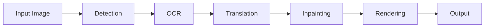

# zyddnys/manga-image-translator

> Traduction automatique du texte dans les images de mangas : détection, OCR, traduction, inpainting, rendu.

## Le problème
Les bandes dessinées et images partagées en ligne ne sont presque jamais traduites professionnellement.

## Ce que ça fait vraiment
Pipeline : détection de texte (default, ctd, craft, paddle), OCR (32px, 48px, mocr), traduction, effacement par inpainting (lama, sd), rendu typographique.
Traducteurs en ligne (DeepL, OpenAI, Gemini, DeepSeek, Groq…) ou hors ligne (NLLB, M2M100, Sugoi, Qwen2).
Modes batch CLI, serveur web, API FastAPI, WebSocket ; config JSON détaillée, glossaires, dictionnaires pré/post.
Export PNG/JPG ou XCF/PSD/PDF via GIMP.

## Comment c'est branché
Le graphe fourni n'a aucun composant lisible ; schéma d'après l'explication :


## Essayer
```bash
git clone https://github.com/zyddnys/manga-image-translator.git
python -m venv venv
source venv/bin/activate
pip install -r requirements.txt
python -m manga_translator local -v -i <path>
```

## Coût et pièges
Traducteurs cloud = clés d'API à ta charge. Image Docker ~15 Go ; modèles téléchargés au premier lancement. GPU conseillé.

## Ce que ce n'est pas
« Early stage » selon ses auteurs ; qualité de rendu anglais imparfaite (zones de texte, pas de bulles). Pas un outil vidéo.

## Alternatives
- Manga Image Translator Rust : binaire compilé plus simple à installer (CLI seule).

## Pour toi
À ignorer comme outil, mais le pipeline détection/OCR/inpainting multi-backends est un bon cas d'étude d'orchestration de modèles de vision.
