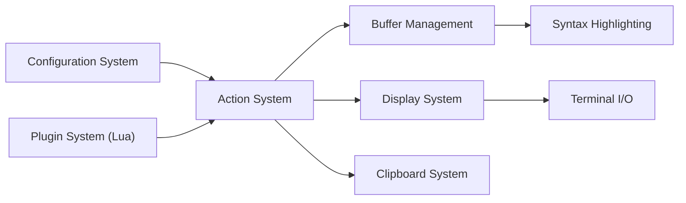

# zyedidia/micro

> Éditeur de texte en terminal, simple et intuitif, livré en binaire statique unique.

## Le problème
Éditer un fichier par SSH oblige à choisir entre nano, sommaire, et vim, difficile à prendre en main.

## Ce que ça fait vraiment
Éditeur en terminal avec raccourcis courants (Ctrl-s, Ctrl-c, Ctrl-v), curseurs multiples, onglets et découpages, bonne prise en charge de la souris, coloration syntaxique pour plus de 130 langages, annulation persistante et macros. Un système de plugins en Lua, avec gestionnaire intégré, l'étend. Le presse-papier système exige xclip, xsel ou wl-clipboard sous Linux.

## Comment c'est branché


## Essayer
```bash
brew install micro
snap install micro --classic
curl https://getmic.ro | bash
micro path/to/file.txt
ip a | micro
```

## Coût et pièges
Gratuit. Le script curl | bash est tiers. Sur Mac, les raccourcis utilisent Ctrl et Alt : le terminal doit transmettre Alt. Cygwin, Mingw et Plan9 ne sont pas pris en charge.

## Ce que ce n'est pas
Pas un IDE : pas de débogage ni de gestion de projet intégrés. Ce dépôt est le même projet que micro-editor/micro (README identique) : doublon du catalogue.

## Alternatives
- nano : dont micro se veut le successeur.

## Pour toi
À adopter : pratique pour éditer des fichiers de configuration sur des serveurs ou conteneurs distants, sans dépendance.

