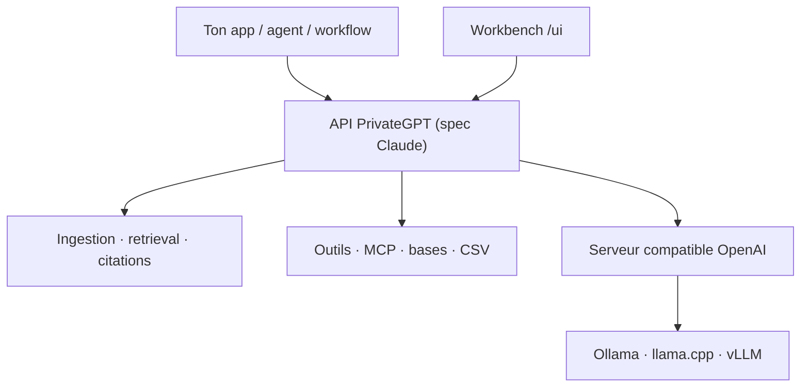

# zylon-ai/private-gpt

> Couche d'API open source qui transforme des modèles locaux en applications IA.

## Le problème
Faire tourner un modèle en local n'est que la première étape : messages, ingestion de documents, citations, outils et MCP restent à recoder à chaque projet.

## Ce que ça fait vraiment
Expose une API calquée sur l'API Claude au-dessus de n'importe quel serveur d'inférence compatible OpenAI (`OPENAI_API_BASE`) : API messages avec streaming, traitement asynchrone et comptage de tokens ; ingestion de fichiers et d'artefacts ; récupération avec citations et RAG agentique ; outils intégrés (recherche web, fetch, exécution de code) ; outils personnalisés et connecteurs MCP ; accès structuré à des bases et des CSV ; embeddings. Un workbench web sur `/ui` sert aux tests et démos.

## Comment c'est branché


## Essayer
```bash
brew tap zylon-ai/tap && brew install private-gpt
ollama pull qwen3.5:35b
OPENAI_API_BASE=http://localhost:<llm-port>/v1 private-gpt serve
```

## Coût et pièges
Gratuit et open source. PrivateGPT **n'exécute pas** de modèle : il te faut un serveur d'inférence à côté, donc la RAM ou le GPU correspondants (le modèle d'exemple pèse ~24 Go). Le cache de prompts et l'OAuth/organisations ne sont pas supportés.

## Ce que ce n'est pas
L'UI est un démonstrateur, pas le produit : l'API est le produit. Ce n'est pas un concurrent d'Ollama ou vLLM mais la couche au-dessus. Onyx et Open WebUI sont des applications finies ; PrivateGPT est l'API sous-jacente. Le support entreprise, le déploiement Kubernetes, le RBAC et les logs SIEM relèvent de Zylon, l'offre commerciale.

## Alternatives
- Ollama, LM Studio, LocalAI, vLLM, llama.cpp : la couche d'inférence, à utiliser *avec*, pas à la place.
- Onyx, Open WebUI : si tu veux une application finie plutôt qu'une API.

## Pour toi
À adopter si tu construis une application IA sur modèles locaux : ça t'évite de réécrire ingestion, citations et outils.
