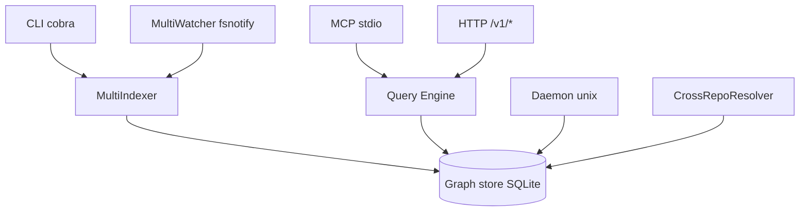

# zzet/gortex

> Moteur d'indexation de code qui expose un graphe de symboles aux agents de codage via MCP.

## Le problème
Un agent qui lit des fichiers entiers pour répondre à « qu'est-ce qui casse si je change ça » brûle du contexte pour rien.
Multiplier les outils d'analyse par langage produit des réponses incohérentes d'un fichier à l'autre.

## Ce que ça fait vraiment
Analyse 257 langages via tree-sitter, avec une résolution renforcée sur une quinzaine de langages compilés, et construit un graphe persistant de fonctions, classes, chaînes d'appel, routes HTTP et contrats inter-services.
Expose ce graphe par MCP (plus de 100 outils annoncés, configurables) à 19 agents de codage détectés automatiquement à l'installation.
Détecte les contrats entre dépôts — HTTP, gRPC, GraphQL, topics Kafka/NATS, WebSocket, variables d'environnement, OpenAPI, workflows Temporal — normalisés en identifiants canoniques.
Un démon unique sert toutes les fenêtres d'IDE, avec un store SQLite sur disque et un suivi fsnotify.

## Comment c'est branché


## Essayer
```bash
curl -fsSL https://get.gortex.dev | sh
gortex install
gortex daemon start --detach
gortex track ~/projects/myapp
cd ~/projects/myapp && gortex init
```

## Coût et pièges
L'indexation de gros dépôts coûte de la mémoire : 5,07 Go de pic mesuré sur `torvalds/linux`, 3 minutes d'indexation.
Compiler depuis les sources demande Go 1.26+ et CGO. La télémétrie est désactivée par défaut et honore `DO_NOT_TRACK`.

## Ce que ce n'est pas
Pas un produit éprouvé : l'ampleur annoncée (257 langages, 19 agents, 9 fournisseurs LLM) dépasse largement ce qu'un README permet de vérifier.
Le chiffre « 50× moins de tokens » est une mesure du dépôt lui-même, pas un résultat indépendant.
Le README annonce alternativement « 175 outils MCP », « 100+ » et « 20 intégrations agents » : les compteurs ne concordent pas.

## Alternatives
Aucune alternative nommée dans le README.

## Pour toi
À regarder si tu passes ta journée dans un agent de codage sur un monorepo ; à ne pas mettre en production tant que la licence n'est pas déclarée.
